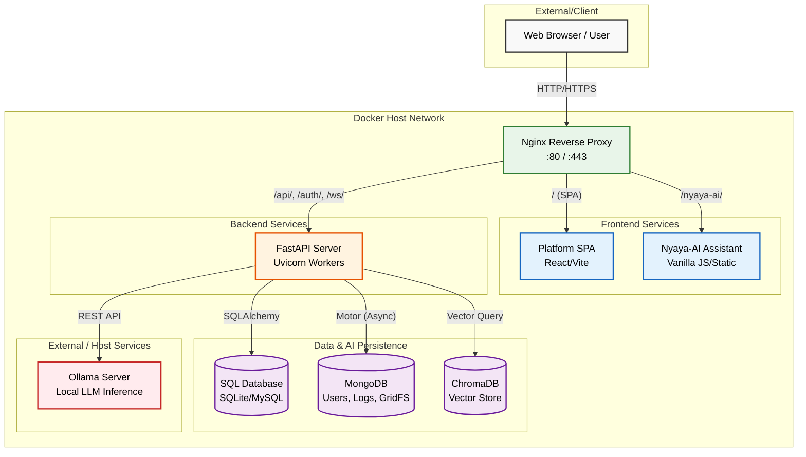
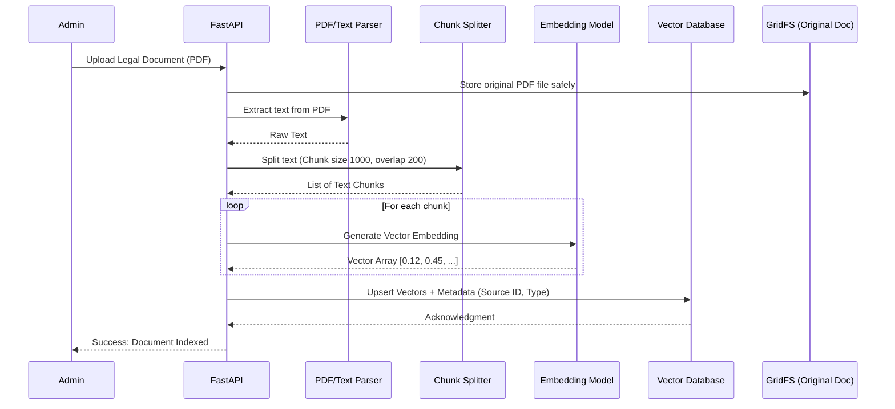
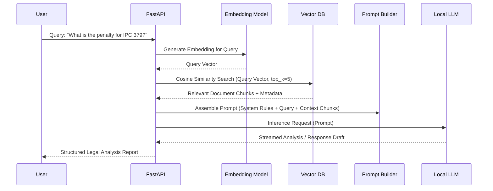
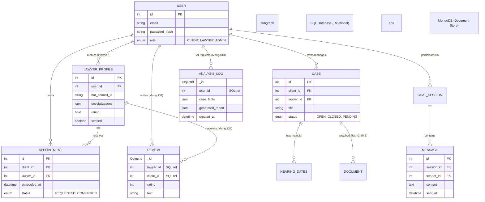
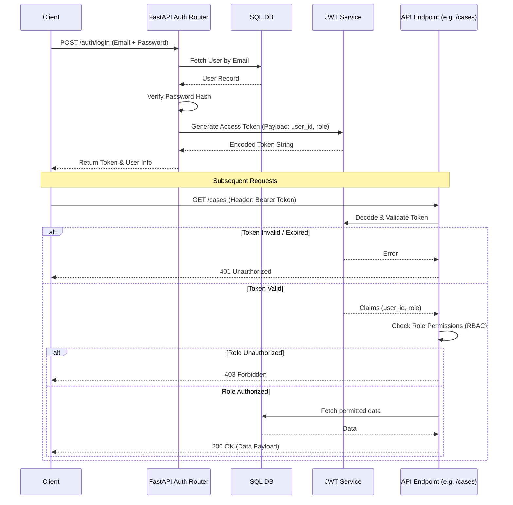
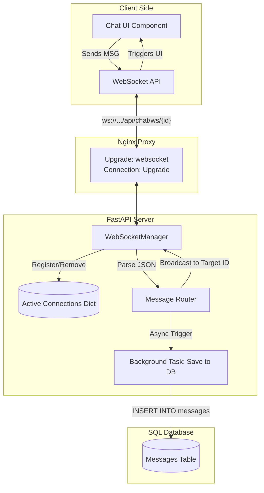

# Nyaya-AI Comprehensive Architecture Deep Dive 🏛️🔍

This document provides in-depth architectural and sequence diagrams for the Nyaya-AI Legal Ecosystem. It covers everything from high-level infrastructure to specific data flows like the Retrieval-Augmented Generation (RAG) pipeline and real-time WebSockets.

---

## 1. High-Level Ecosystem Topology

This diagram illustrates the overall infrastructure when deployed via Docker, highlighting the role of the Nginx Reverse Proxy as the central gateway routing traffic to specific containers.



---

## 2. Advanced RAG (Retrieval-Augmented Generation) Pipeline

Nyaya-AI uses a privacy-first local RAG pipeline to analyze case facts against stored legal precedents and statutes.

### 2a. Document Ingestion Flow
How legal PDFs and documents are processed and stored.



### 2b. Legal Query Processing Flow
How a user's question or case facts are analyzed.



---

## 3. Entity-Relationship Model (Hybrid Database)

We use **SQL** for strict transactional integrity (users, cases, finances) and **MongoDB** for unstructured or heavy data (chat history, AI logs, files).



---

## 4. Security & Authentication Flow

Role-Based Access Control (RBAC) and JWT lifecycle.



---

## 5. Real-Time WebSocket Chat Architecture

Ensuring instant communication between clients and lawyers with persistent history.



---

## 6. Directory Structure Mapping

A visual map of how the codebase maps to the unified architecture.

```text
aiLegalEcosystem/
├── client/
│   ├── platform/          => Main React Application (Dashboards, Chat, Auth)
│   │   ├── src/components/
│   │   ├── nginx.conf     => Master Reverse Proxy Configuration
│   │   └── Dockerfile     => Frontend Build
│   └── nyaya-ai/          => Legal Assistant SPA
│       ├── index.html     => Vanilla JS Interface
│       └── Dockerfile     => Static File Server (Nginx)
├── server/                => FastAPI Backend
│   ├── app/
│   │   ├── api/           => Route Controllers
│   │   ├── core/          => Config, JWT Security
│   │   ├── models/        => SQLAlchemy Models
│   │   └── services/      => Ollama, Chroma, VectorDB Logic
│   ├── legal_services.db  => SQLite (Fallback/Dev SQL)
│   ├── chroma_db/         => Vector Embeddings Storage
│   └── Dockerfile         => Python Multi-stage Build
├── docker-compose.yml     => Orchestrates Platform, Nyaya-AI, Server, MongoDB
├── package.json           => Root commands (`npm run dev`)
└── ARCHITECTURE.md        => This document
```
