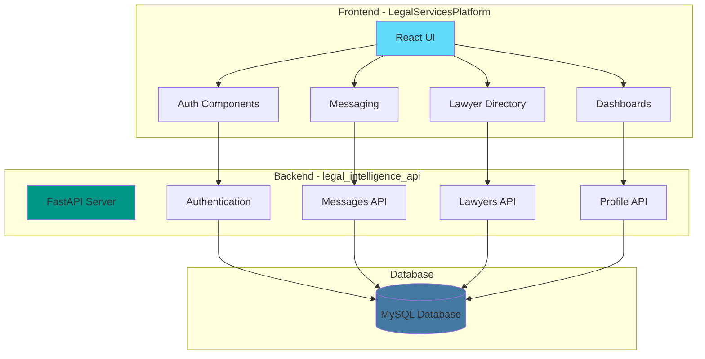
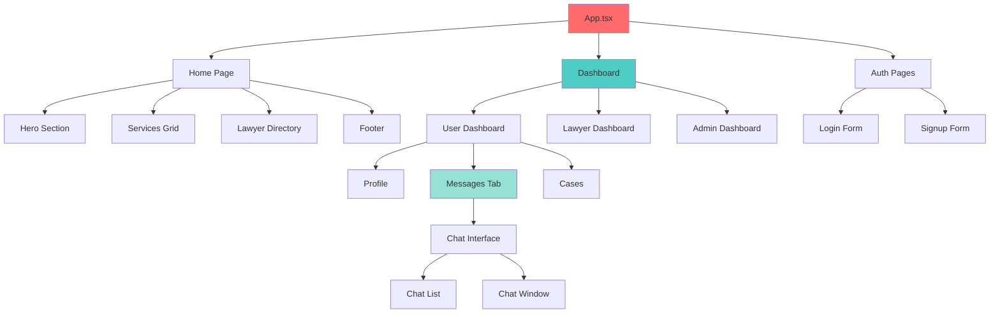

# Contributing to NyayaAssist (AI Legal Ecosystem) 🤝

First off, thank you for considering contributing to NyayaAssist! It's people like you that make this platform a great tool for the legal community in India.

## 📋 Table of Contents

- [Code of Conduct](#code-of-conduct)
- [Getting Started](#getting-started)
- [How Can I Contribute?](#how-can-i-contribute)
- [Development Workflow](#development-workflow)
- [Style Guidelines](#style-guidelines)
- [Commit Guidelines](#commit-guidelines)
- [Pull Request Process](#pull-request-process)
- [Community](#community)

---

## 📜 Code of Conduct

This project and everyone participating in it is governed by our Code of Conduct. By participating, you are expected to uphold this code. Please report unacceptable behavior to the project maintainers.

### Our Pledge

We pledge to make participation in our project a harassment-free experience for everyone, regardless of:
- Age, body size, disability, ethnicity, gender identity and expression
- Level of experience, education, socio-economic status
- Nationality, personal appearance, race, religion
- Sexual identity and orientation

### Our Standards

**Positive behavior includes:**
- Using welcoming and inclusive language
- Being respectful of differing viewpoints and experiences
- Gracefully accepting constructive criticism
- Focusing on what is best for the community
- Showing empathy towards other community members

**Unacceptable behavior includes:**
- Trolling, insulting/derogatory comments, and personal or political attacks
- Public or private harassment
- Publishing others' private information without explicit permission
- Other conduct which could reasonably be considered inappropriate

---

## 🚀 Getting Started

### Prerequisites

Before you begin, ensure you have the following installed:
- **Node.js** (v18.x or higher)
- **npm** (v9.x or higher)
- **Python** (v3.10 or higher) - for Backend API
- **pip** - Python package manager
- **XAMPP** (or MySQL Server) - for Database
- **Git**
- A code editor (we recommend **VS Code**)

### Setting Up Your Development Environment

1. **Fork the Repository**
   
   Click the "Fork" button at the top right of the repository page.

2. **Clone Your Fork**
   ```bash
   git clone https://github.com/YOUR_USERNAME/ai_legal_ecosystem.git
   cd ai_legal_ecosystem
   ```

3. **Install Frontend Dependencies**
   Navigate to the frontend directory:
   ```bash
   cd LegalServicesPlatform
   npm install
   ```

4. **Set Up the Database**
   - Start **XAMPP Control Panel**.
   - Start the **Apache** and **MySQL** modules.
   - (Optional) Use `setup_mysql.py` in the backend folder to verify/reset DB:
     ```bash
     cd ../legal_intelligence_api
     python setup_mysql.py
     ```

5. **Set Up Backend API**
   Navigate to the backend directory:
   ```bash
   cd ../legal_intelligence_api
   ```
   
   Create and activate a virtual environment (recommended):
   ```bash
   python -m venv venv
   # Windows
   venv\Scripts\activate
   # Bash
   source venv/bin/activate
   ```

   Install dependencies:
   ```bash
   pip install -r requirements.txt
   ```

   Start the API server:
   ```bash
   uvicorn app.main:app --reload
   ```
   The API will run on `http://localhost:8000`.

6.  **Start Frontend Development Server**
    Open a new terminal, navigate to `LegalServicesPlatform`, and run:
    ```bash
    npm run dev
    ```
    The app will open at `http://localhost:5173`.

### Architecture Overview



### Component Hierarchy



---

## 🎯 How Can I Contribute?

### Reporting Bugs 🐛

Before creating bug reports, please check the existing issues to avoid duplicates. When you create a bug report, include as many details as possible:

**Bug Report Template:**
```markdown
**Describe the bug**
A clear and concise description of what the bug is.

**To Reproduce**
Steps to reproduce the behavior:
1. Go to '...'
2. Click on '....'
3. Scroll down to '....'
4. See error

**Expected behavior**
A clear and concise description of what you expected to happen.

**Screenshots**
If applicable, add screenshots to help explain your problem.

**Environment:**
 - OS: [e.g. Windows 11, macOS 13.0]
 - Browser: [e.g. Chrome 120, Firefox 121]
 - Node Version: [e.g. 18.17.0]
 - npm Version: [e.g. 9.6.7]

**Additional context**
Add any other context about the problem here.
```

### Suggesting Enhancements 💡

Enhancement suggestions are tracked as GitHub issues. When creating an enhancement suggestion, include:

**Enhancement Template:**
```markdown
**Is your feature request related to a problem?**
A clear and concise description of what the problem is.

**Describe the solution you'd like**
A clear and concise description of what you want to happen.

**Describe alternatives you've considered**
A clear and concise description of any alternative solutions or features you've considered.

**Additional context**
Add any other context or screenshots about the feature request here.

**Potential Implementation**
If you have ideas on how to implement this, please share them.
```

### Contributing Code 💻

#### Types of Contributions

1. **Bug Fixes**: Fix existing bugs in the codebase
2. **New Features**: Implement new functionality
3. **Documentation**: Improve or add documentation
4. **Performance**: Optimize existing code
5. **Testing**: Add or improve tests
6. **Refactoring**: Improve code structure without changing functionality

#### Good First Issues

Look for issues labeled `good first issue` or `beginner-friendly` if you're new to the project.

---

## 🔄 Development Workflow

### Branch Naming Convention

Use descriptive branch names with the following prefixes:

- `feature/` - New features (e.g., `feature/add-case-export`)
- `fix/` - Bug fixes (e.g., `fix/chat-scroll-issue`)
- `docs/` - Documentation updates (e.g., `docs/update-api-guide`)
- `refactor/` - Code refactoring (e.g., `refactor/simplify-state-management`)
- `test/` - Adding or updating tests (e.g., `test/add-component-tests`)
- `perf/` - Performance improvements (e.g., `perf/optimize-search`)
- `chore/` - Maintenance tasks (e.g., `chore/update-dependencies`)

### Development Process

1. **Create a Branch**
   ```bash
   git checkout -b feature/your-feature-name
   ```

2. **Make Your Changes**
   - Write clean, readable code
   - Follow the style guidelines
   - Add comments where necessary
   - Update documentation if needed

3. **Test Your Changes**
   ```bash
   npm run lint        # Check for linting errors
   npm run typecheck   # Check TypeScript types
   npm run build       # Ensure build succeeds
   ```

4. **Commit Your Changes**
   ```bash
   git add .
   git commit -m "feat: add amazing new feature"
   ```

5. **Keep Your Branch Updated**
   ```bash
   git fetch upstream
   git rebase upstream/main
   ```

6. **Push to Your Fork**
   ```bash
   git push origin feature/your-feature-name
   ```

7. **Create a Pull Request**
   - Go to the original repository
   - Click "New Pull Request"
   - Select your branch
   - Fill out the PR template

---

## 🎨 Style Guidelines

### TypeScript/JavaScript Style

- Use **TypeScript** for all new code
- Follow **ESLint** rules configured in the project
- Use **functional components** with hooks
- Prefer **const** over **let**, avoid **var**
- Use **arrow functions** for callbacks
- Use **async/await** instead of promises chains

### React Component Guidelines

1. **Component Structure**
   ```typescript
   // Imports
   import { useState, useEffect } from 'react';
   import { ComponentProps } from './types';
   
   // Interface/Type definitions
   interface MyComponentProps {
     title: string;
     onSubmit: (data: FormData) => void;
   }
   
   // Component
   export const MyComponent: React.FC<MyComponentProps> = ({ title, onSubmit }) => {
     // Hooks
     const [state, setState] = useState<string>('');
     
     // Event handlers
     const handleClick = () => {
       // handler logic
     };
     
     // Effects
     useEffect(() => {
       // effect logic
     }, []);
     
     // Render
     return (
       <div>
         {/* JSX */}
       </div>
     );
   };
   ```

2. **Props Destructuring**
   ```typescript
   // Good ✅
   const Header: React.FC<HeaderProps> = ({ title, subtitle }) => {
     return <h1>{title}</h1>;
   };
   ```

3. **State Management**
   - Use `useState` for local component state
   - Use `useEffect` for side effects
   - Keep state as close to where it's used as possible
   - Lift state up only when necessary

---

## 📝 Commit Guidelines

We follow the [Conventional Commits](https://www.conventionalcommits.org/) specification.

### Commit Message Format

```
<type>(<scope>): <subject>

<body>

<footer>
```

### Types

- `feat`: A new feature
- `fix`: A bug fix
- `docs`: Documentation only changes
- `style`: Changes that don't affect code meaning (formatting, etc.)
- `refactor`: Code change that neither fixes a bug nor adds a feature
- `perf`: Performance improvement
- `test`: Adding or updating tests
- `chore`: Changes to build process or auxiliary tools

---

## 🔀 Pull Request Process

### Before Submitting

1. ✅ Ensure your code follows the style guidelines
2. ✅ Update documentation if needed
3. ✅ Add tests for new features
4. ✅ Ensure all tests pass
5. ✅ Update the CHANGELOG.md if applicable
6. ✅ Rebase your branch on the latest main

### Review Process

1. At least one maintainer must approve the PR
2. All CI checks must pass
3. No merge conflicts with main branch
4. Code review feedback must be addressed

---

## 🧪 Testing Guidelines

### Writing Tests

- Write tests for all new features
- Ensure tests are deterministic
- Use descriptive test names
- Follow the AAA pattern: Arrange, Act, Assert

### Running Tests

```bash
# Run all tests
npm test
```

---

## 📚 Documentation Guidelines

### Code Documentation

- Add JSDoc comments for functions and components
- Explain complex logic with inline comments
- Keep comments up-to-date with code changes

### README Updates

- Update README.md if new features are added
- Keep installation instructions current
