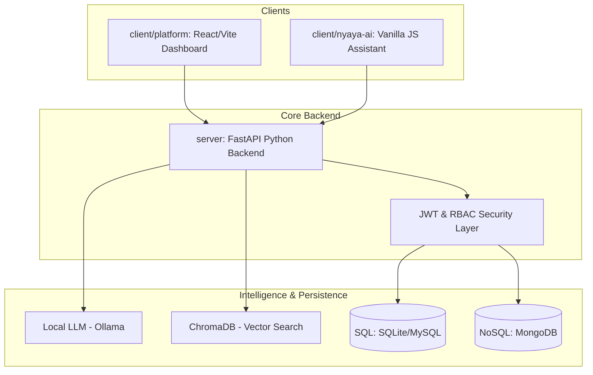

# Contributing to Nyaya-AI 🤝

First off, thank you for considering contributing to **Nyaya-AI**! You are helping build India's premier privacy-focused legal ecosystem.

## 📋 Table of Contents

- [Code of Conduct](#code-of-conduct)
- [Project Architecture](#project-architecture)
- [Getting Started](#getting-started)
- [How Can I Contribute?](#how-can-i-contribute)
- [Development Workflow](#development-workflow)
- [Style Guidelines](#style-guidelines)
- [Commit Guidelines](#commit-guidelines)

---

## 📜 Code of Conduct

This project is governed by our Code of Conduct. By participating, you are expected to uphold this code. We are committed to providing a harassment-free experience for everyone.

---

## 🏗 Project Architecture

Nyaya-AI is a multi-client, unified-backend ecosystem.


```mermaid
graph TD
    subgraph "Clients"
        Platform[client/platform: React/Vite Dashboard]
        NyayaAI[client/nyaya-ai: Vanilla JS Assistant]
    end
    
    subgraph "Core Backend"
        API[server: FastAPI Python Backend]
        Auth[JWT & RBAC Security Layer]
    end
    
    subgraph "Intelligence & Persistence"
        Ollama[Local LLM - Ollama]
        VectorDB[ChromaDB - Vector Search]
        SQL[(SQL: SQLite/MySQL)]
        NoSQL[(NoSQL: MongoDB)]
    end
    
    Platform --> API
    NyayaAI --> API
    API --> Auth
    Auth --> SQL
    Auth --> NoSQL
    API --> VectorDB
    API --> Ollama
```

---

## 🚀 Getting Started

### Prerequisites

- **Node.js** (v18.x or higher)
- **Python** (v3.11 or higher)
- **Ollama** (Required for localized AI features)
- **Git**
- A code editor (we recommend **VS Code**)

### Local Development Setup

1. **Fork & Clone**
   ```bash
   git clone https://github.com/YOUR_USERNAME/ai_legal_ecosystem.git
   cd ai_legal_ecosystem
   ```

2. **Unified Installation**
   Run the root-level installation script to set up all sub-projects:
   ```bash
   npm run install:all
   ```

3. **Backend Configuration**
   - Navigate to `server/`
   - Create a `.env` file from `.env.example`.
   - Ensure your virtual environment is active (`source .venv/bin/activate` or `.venv\Scripts\activate`).

4. **Running the Ecosystem**
   You can start all three main components (Platform, Nyaya-AI, Backend) with one command from the root:
   ```bash
   npm run dev
   ```

---

## 🔄 Development Workflow

### Branch Naming Convention

- `feat/` - New features (e.g., `feat/case-export-logic`)
- `fix/` - Bug fixes
- `docs/` - Documentation updates
- `refactor/` - Code refactoring
- `chore/` - Maintenance (dependency updates, configuration)

### Pull Request Process

1. **Create a Branch**: `git checkout -b feat/your-feature`
2. **Implement & Test**: Ensure your changes don't break the build (`npm run build`).
3. **Commit with Conventional Commits**: `git commit -m "feat: add case status visualization"`
4. **Update Documentation**: If you change an API or a major UI component, update the README or relevant docs.
5. **Open a PR**: Point your branch to the `main` branch of the original repository.

---

## 🎨 Style Guidelines

### Frontend (React)
- **Framework**: Use React 18+ and TypeScript.
- **Styling**: Use **Tailwind CSS** for layouts.
- **Icons**: Use **Lucide React**.
- **Animation**: Use **Framer Motion** for premium UI transitions.
- **State**: Use **Zustand** for global client state.

### Backend (Python)
- **Framework**: FastAPI.
- **Persistence**: Use SQLAlchemy for relational data and Motor/Pymongo for MongoDB.
- **Type Hinting**: Mandatory for all function signatures and Pydantic models.
- **Validation**: Use Pydantic V2 for schema validation.

---

## 📝 Commit Guidelines

We follow [Conventional Commits](https://www.conventionalcommits.org/):

- `feat`: A new feature
- `fix`: A bug fix
- `docs`: Documentation changes
- `style`: Formatting, missing semi-colons, etc.
- `refactor`: Refactoring production code
- `perf`: Performance improvements
- `test`: Adding missing tests
- `chore`: Updating build tasks, dependencies, etc.

---

## 📄 License

By contributing, you agree that your contributions will be licensed under the project's MIT License.
