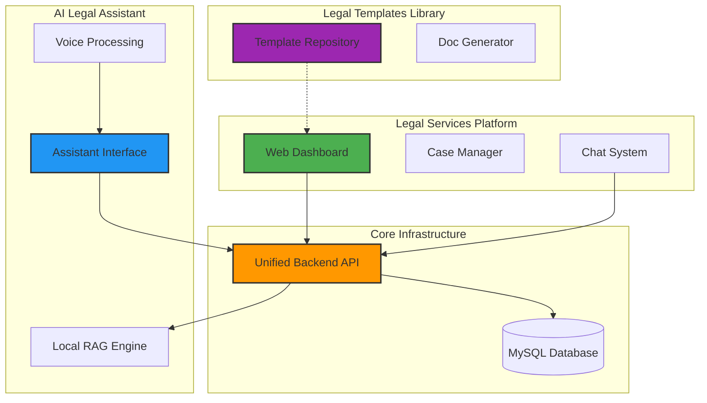
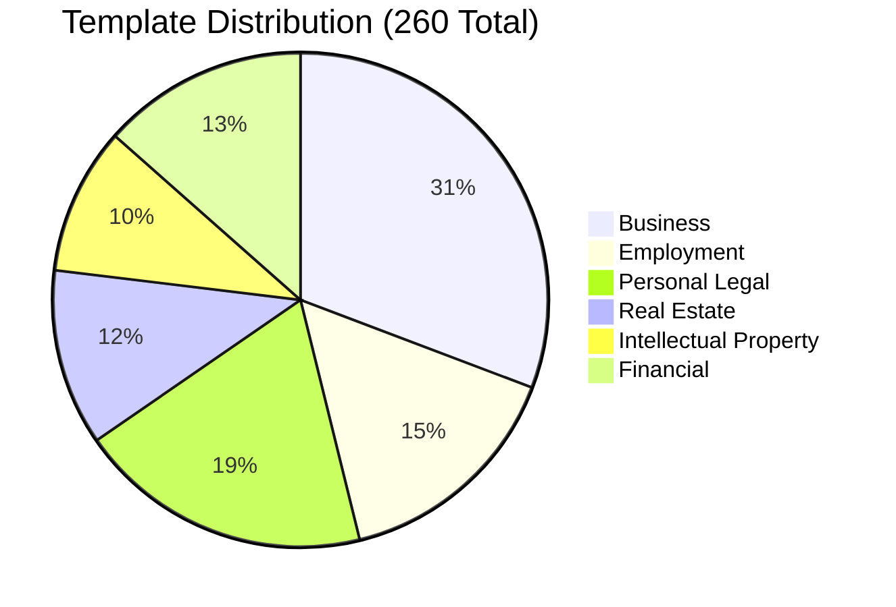
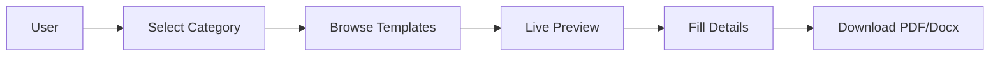
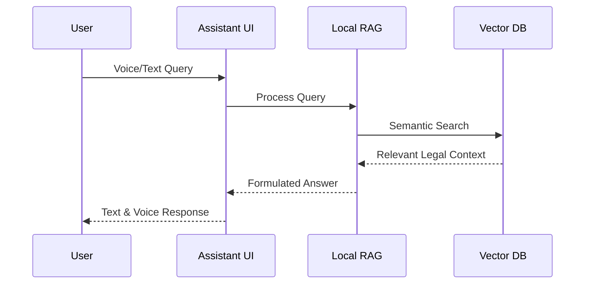
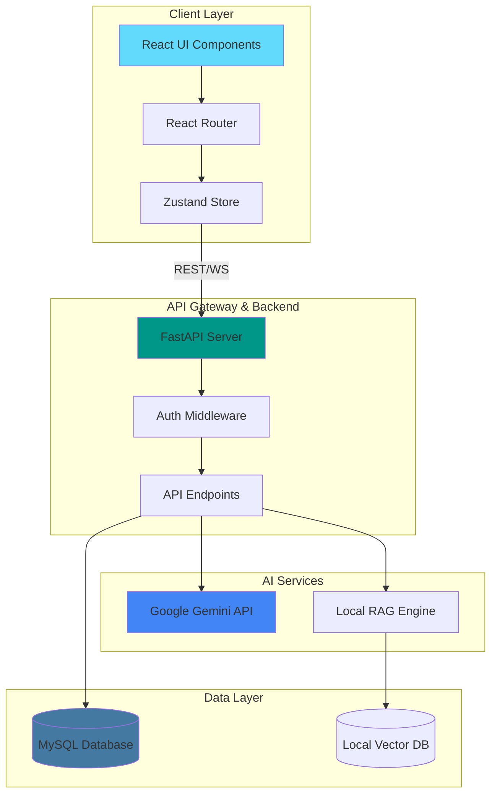
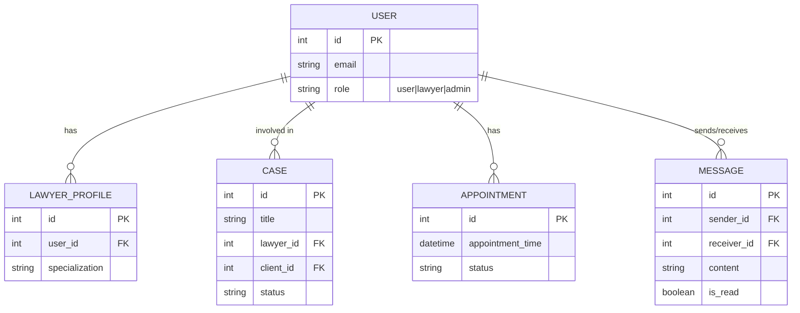
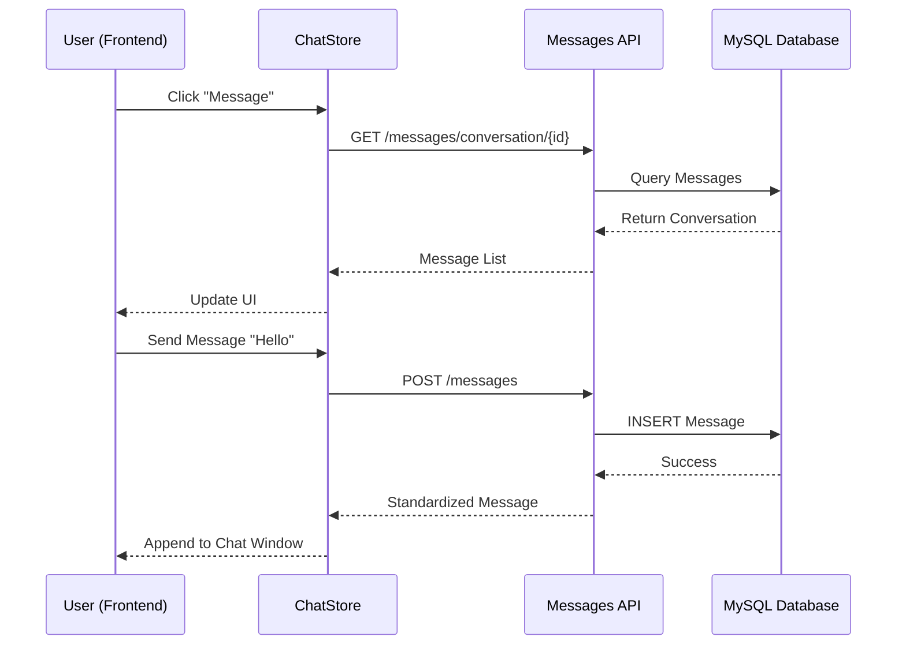
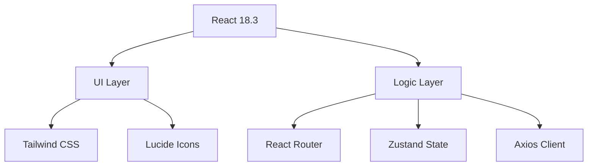
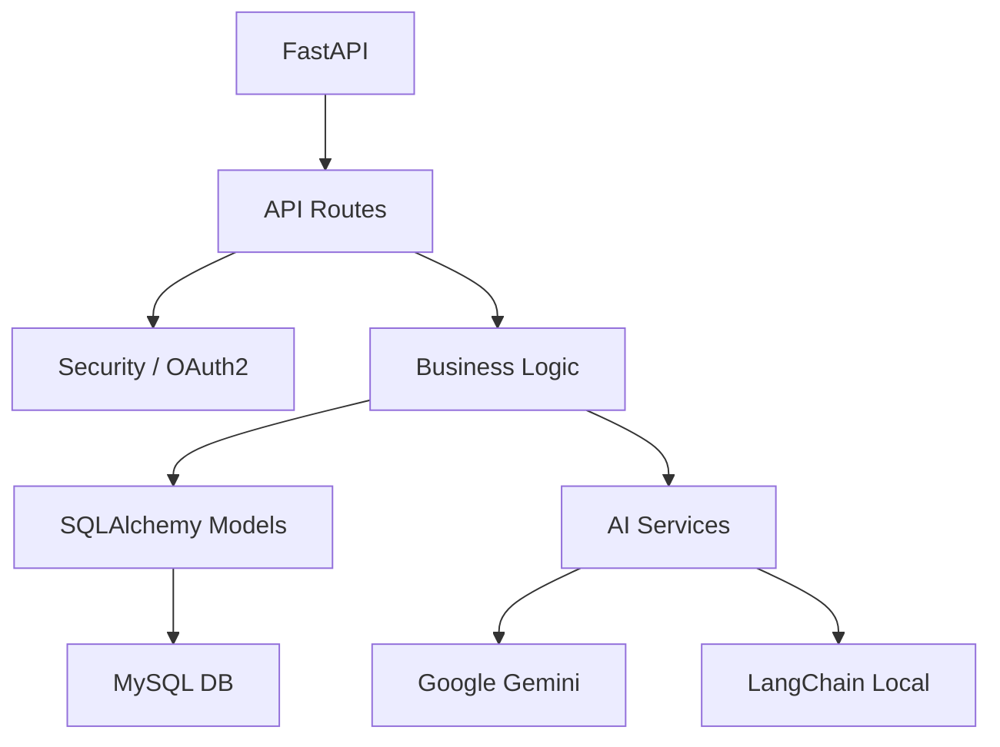

# NyayaAssist - AI Legal Ecosystem 🏛️⚖️

<div align="center">


**NyayaAssist - India's premier AI-powered legal platform connecting citizens with verified lawyers. Comprehensive legal research, instant messaging, intelligent case management, and seamless appointment scheduling.**

[Features](#-features) • [Architecture](#-system-architecture) • [Installation](#-installation) • [Usage](#-usage) • [Contributing](#-contributing)

</div>

---

## 📋 Table of Contents

- [Overview](#-overview)
- [Features](#-features)
- [Ecosystem Overview (ERP View)](#-ecosystem-overview-erp-view)
- [System Architecture](#-system-architecture)
- [Entity Relationship Diagram](#-entity-relationship-diagram)
- [Detailed Component Diagrams](#-detailed-component-diagrams)
- [Module Details](#-module-details)
    - [Legal Services Platform](#1-legal-services-platform)
    - [Legal Templates Library](#2-legal-templates-library-legaltemplate)
    - [AI Legal Assistant](#3-ai-legal-assistant-ailegalassistant)
- [Technology Stack](#-technology-stack)
- [Installation](#-installation)
- [Contributing](#-contributing)
- [License](#-license)

---

## 🌟 Overview

**AI Legal Ecosystem** is a unified legal technology platform that bridges the gap between legal professionals and citizens. It combines advanced AI for case analysis with robust practice management tools for lawyers.

For **Citizens**, it offers AI-driven legal insights, easy access to verified lawyers, and a simple way to manage their legal journey.
For **Lawyers**, it provides a comprehensive dashboard to manage cases, appointments, client communications, and specialized profiles.

---

## ✨ Features

### 1. **Role-Based Dashboards**
- **User Dashboard**: Track your legal cases, view upcoming appointments, and manage lawyer communications.
- **Lawyer Dashboard**: specialized interface for practice management, case tracking, and client interactions.
- **Admin Dashboard**: System-wide oversight of users, lawyers, and platform metrics.

### 2. **Intelligent Case Management**
- **Create & Manage**: Lawyers can create new patient/client files, track case status, and update details.
- **Visibility**: Clients get real-time visibility into their case progress and next hearing dates.
- **Deletion**: Secure deletion of cases with strict ownership validation (Lawyers only).

### 3. **Appointment Scheduling**
- **Easy Booking**: Lawyers can schedule consultations and hearings directly from the dashboard.
- **Status Tracking**: Track appointments (Scheduled, Confirmed, Completed).
- **Calendar Integration**: Visual list of upcoming commitments.

### 4. **Real-Time Messaging System** 💬
- **Direct Communication**: Secure, private chat between lawyers and their clients.
- **Instant Access**: "Message" buttons integrated directly into Case and Appointment cards.
- **Notification**: Unread message counts and real-time updates.
- **Persistent History**: All conversations are saved securely for future reference.

### 5. **AI Case Analysis Engine** 🧠
- **Precedent Matching**: Input case facts to find relevant legal precedents using AI.
- **Strength Assessment**: Percentage-based scoring of case strength.
- **Strategy Generation**: AI-identified strong/weak points and actionable legal advice.

### 6. **Local Legal Assistant** 🤖
- **RAG-Powered**: Retrieval-Augmented Generation using a local vector database.
- **Privacy-First**: runs locally to ensure data privacy.
- **Voice Support**: Voice input and Text-to-Speech output for accessibility.

---

## 🌐 Ecosystem Overview (ERP View)

A high-level view of how the different applications in the ecosystem connect and share resources.



---

## 📦 Module Details

### 1. Legal Services Platform
The core web application connecting lawyers and clients.

- **Directory**: `LegalServicesPlatform/`
- **Tech**: React, TypeScript, Tailwind CSS
- **Function**: Handles authentication, dashboards, case tracking, and messaging.

### 2. Legal Templates Library (`legalTemplate`)
A comprehensive repository of legal forms and document templates.

- **Directory**: `legalTemplate/`
- **Contents**: 
    - `templates/`: collection of categorized HTML/PDF templates (Contracts, Agreements, Affidavits).
    - `legalforms/`: Standardized legal forms for various jurisdictions.
- **Usage**: Used by the platform to generate ready-to-use documents for clients.





### 3. AI Legal Assistant (`aiLegalAssistant`)
A standalone, privacy-focused AI assistant for answering legal queries.

- **Directory**: `aiLegalAssistant/`
- **Tech**: React, Local Vector DB, Speech API
- **Key Feature**: Runs independently to provide quick legal answers without exposing sensitive case data to external cloud providers.



---

## 🏗️ System Architecture

The system follows a modern client-server architecture with AI integration:



---

## 📊 Entity Relationship Diagram

The core database schema supporting the application:



---

## 🧩 Detailed Component Diagrams

### 1. Messaging System Flow

How the real-time chat works between users and lawyers:



---

## 🛠️ Technology Stack

### Frontend Components


### Backend Structure


---

## � Future Roadmap

We are constantly improving NyayaAssist. Here is what's coming next:

- [ ] **Mobile Application**: Native React Native app for iOS and Android.
- [ ] **Blockchain Evidence**: Secure, immutable storage for legal documents and evidence.
- [ ] **Multilingual Support**: Expanding support for Hindi, Tamil, Telugu, and other regional languages.
- [ ] **e-Courts Integration**: Direct integration with Indian e-Courts services for case filing status.
- [ ] **AI Contract Review**: Automated risk assessment for uploaded contracts.

---

## ❓ Troubleshooting & FAQ

**Q: "Module not found" error when running backend?**
A: Ensure you have activated your virtual environment (`venv\Scripts\activate`) and installed requirements (`pip install -r requirements.txt`).

**Q: Database connection failed?**
A: Make sure XAMPP is running and the MySQL module is started (Port 3306). The default user is `root` with no password.

**Q: Where is the API documentation?**
A: Once the backend is running, visit `http://localhost:8000/docs` for the interactive Swagger UI.

---

## �🚀 Installation

### Prerequisites
1.  **Node.js** (v18+)
2.  **Python** (v3.10+)
3.  **XAMPP** (or any MySQL server)

### Step 1: Clone the Repository
```bash
git clone https://github.com/quantumNexus0/ai_legal_ecosystem.git
cd ai_legal_ecosystem
```

### Step 2: Database Setup
1.  Start **XAMPP Control Panel**.
2.  Start the **Apache** and **MySQL** modules.
3.  The application will automatically create the `legal_services` database on first run, or you can run the setup script:
    ```bash
    cd legal_intelligence_api
    python setup_mysql.py
    ```

### Step 3: Backend Setup
1.  Navigate to the backend directory:
    ```bash
    cd legal_intelligence_api
    ```
2.  Create a virtual environment (optional but recommended):
    ```bash
    python -m venv venv
    # Windows
    venv\Scripts\activate
    # Mac/Linux
    source venv/bin/activate
    ```
3.  Install dependencies:
    ```bash
    pip install -r requirements.txt
    ```
4.  Run the server:
    ```bash
    uvicorn app.main:app --reload
    ```
    The API will be available at `http://localhost:8000`.

### Step 4: Frontend Setup
1.  Open a new terminal and navigate to the frontend directory:
    ```bash
    cd LegalServicesPlatform
    ```
2.  Install dependencies:
    ```bash
    npm install
    ```
3.  Start the development server:
    ```bash
    npm run dev
    ```
    The application will be available at `http://localhost:5173`.

### Step 5: AI Assistant Setup (Optional)
If you want to run the separate AI Assistant frontend:
1.  Navigate to `aiLegalAssistant`:
    ```bash
    cd aiLegalAssistant
    npm install
    npm run dev
    ```

---

## 👥 Contributing

Contributions are welcome! Please read our [Contributing Guide](CONTRIBUTING.md) for details on our code of conduct and the process for submitting pull requests.

---

## 📄 License

This project is licensed under the MIT License - see the [LICENSE](LICENSE) file for details.
