# AI Legal Ecosystem 🏛️⚖️

<div align="center">


**An intelligent legal case analysis platform powered by AI, providing comprehensive legal research, case matching, and document analysis capabilities.**

[Features](#-features) • [Architecture](#-system-architecture) • [Installation](#-installation) • [Usage](#-usage) • [Contributing](#-contributing)

</div>

---

## 📋 Table of Contents

- [Overview](#-overview)
- [Features](#-features)
- [System Architecture](#-system-architecture)
- [Entity Relationship Diagram](#-entity-relationship-diagram)
- [Data Flow Diagram](#-data-flow-diagram)
- [Component Architecture](#-component-architecture)
- [Technology Stack](#-technology-stack)
- [Installation](#-installation)
- [Configuration](#-configuration)
- [Usage](#-usage)
- [API Documentation](#-api-documentation)
- [Project Structure](#-project-structure)
- [Contributing](#-contributing)
- [License](#-license)

---

## 🌟 Overview

**AI Legal Ecosystem** is a comprehensive legal technology platform that leverages artificial intelligence to revolutionize legal research and case analysis. The platform integrates multiple AI services, legal databases, and document processing capabilities to provide lawyers, legal researchers, and law students with powerful tools for case analysis, precedent matching, and legal document understanding.

### Key Capabilities

- 🔍 **Intelligent Case Analysis**: AI-powered analysis of legal cases with precedent matching
- 📚 **Legal Database Integration**: Real-time access to Indian Kanoon and Court Listener databases
- 💬 **AI Legal Assistant**: Interactive chat interface with Gemini AI for legal queries
- 📄 **Document Analysis**: Upload and analyze legal documents (PDF, DOCX, TXT)
- 📊 **Analytics Dashboard**: Visualize case statistics and analysis trends
- 🔄 **Case Comparison**: Side-by-side comparison of user cases with matched precedents
- 📖 **Case Library**: Comprehensive repository of analyzed cases with search functionality
- 🎯 **Strength Assessment**: Automated evaluation of case strength with actionable advice

---

## ✨ Features

### 1. **Case Analysis Engine**
- Input case facts, parties, legal issues, and applicable sections
- AI-powered matching with relevant precedents from legal databases
- Strength assessment with percentage-based scoring
- Identification of strong and weak points
- Expected case direction prediction
- Actionable legal advice generation

### 2. **Local Legal Intelligence Assistant**
- Real-time search interface powered by local Legal Intelligence API
- Question-and-answer retrieval from local legal database
- Displays top 2 most relevant results for each query
- Voice input support for hands-free interaction
- Text-to-speech for reading answers aloud
- Conversation history management
- No external AI dependencies - all data stays local

### 3. **Legal Database Integration**
- **Indian Kanoon API**: Access to Indian case law database
- **Court Listener API**: US federal and state court decisions
- Real-time search and retrieval of relevant cases
- Citation extraction and court information
- Headline and ratio decidendi extraction

### 4. **Document Processing**
- PDF text extraction and analysis
- DOCX document parsing
- Plain text file support
- AI-powered document summarization
- Key legal points identification
- Issue and concern highlighting

### 5. **Analytics & Visualization**
- Analysis history tracking
- Case statistics dashboard
- Trend visualization
- Success rate metrics
- Section-wise analysis distribution

### 6. **Case Comparison**
- Parameter-by-parameter comparison
- Similarity scoring
- Visual comparison tables
- Fact pattern matching
- Evidence type analysis
- Outcome prediction

---

## 🏗️ System Architecture

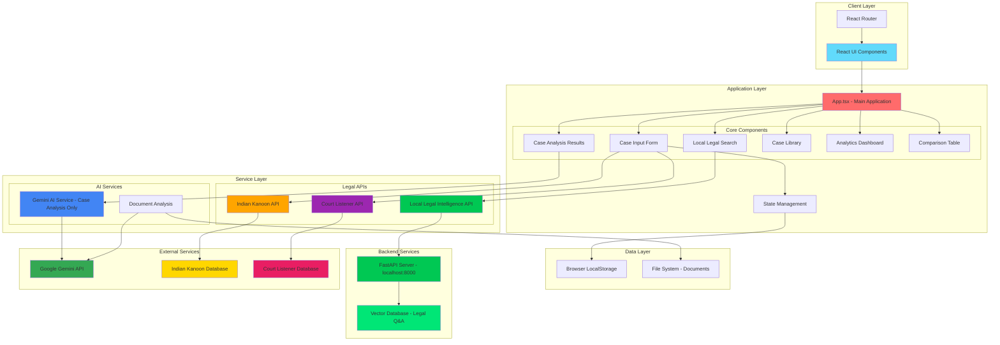

### Architecture Layers Explained

1. **Client Layer**: React-based user interface with component routing
2. **Application Layer**: Core business logic and state management
3. **Service Layer**: Integration with AI services and legal APIs
4. **Data Layer**: Persistent storage and file management
5. **Backend Services**: Local FastAPI server with vector database for legal Q&A
6. **External Services**: Third-party APIs and databases

---

## 📊 Entity Relationship Diagram

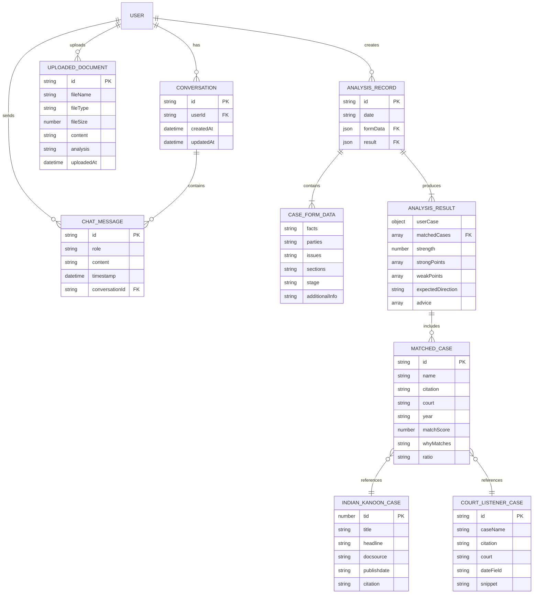

### Entity Descriptions

- **USER**: Application users (implicit, managed by browser session)
- **ANALYSIS_RECORD**: Historical record of case analyses
- **CASE_FORM_DATA**: Input data for case analysis
- **ANALYSIS_RESULT**: AI-generated analysis output
- **MATCHED_CASE**: Precedent cases matched to user's case
- **CHAT_MESSAGE**: Individual messages in AI chat
- **CONVERSATION**: Chat conversation sessions
- **UPLOADED_DOCUMENT**: Legal documents uploaded for analysis
- **INDIAN_KANOON_CASE**: Cases from Indian Kanoon database
- **COURT_LISTENER_CASE**: Cases from Court Listener database

---

## 🔄 Data Flow Diagram

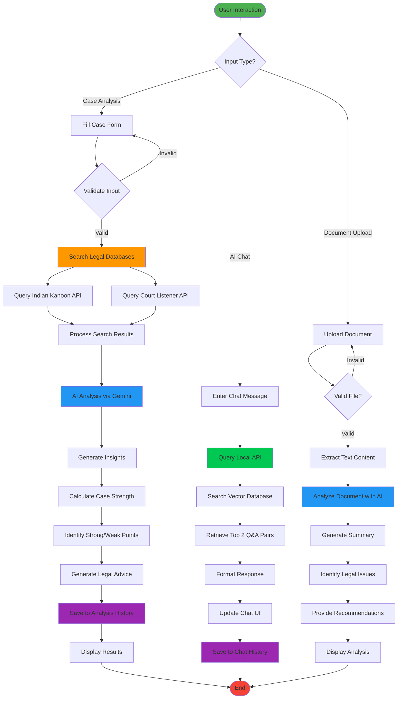

### Data Flow Stages

1. **Input Stage**: User provides case details, chat messages, or documents
2. **Validation Stage**: Input validation and preprocessing
3. **Processing Stage**: API calls to legal databases and AI services
4. **Analysis Stage**: AI-powered analysis and insight generation
5. **Storage Stage**: Persistence to local storage
6. **Display Stage**: Rendering results in the UI

---

## 🧩 Component Architecture

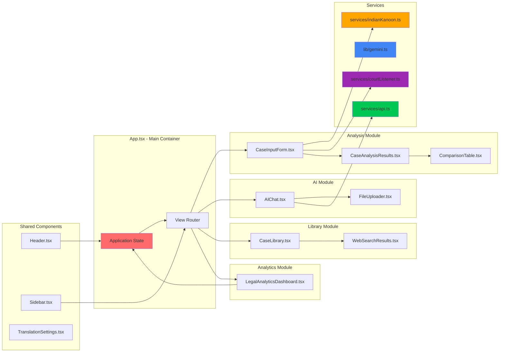

### Component Responsibilities

- **App.tsx**: Main application container, state management, routing
- **Header**: Application branding and navigation
- **Sidebar**: View selection and navigation menu
- **CaseInputForm**: Case details input interface
- **CaseAnalysisResults**: Display analysis results and insights
- **ComparisonTable**: Side-by-side case comparison
- **AIChat**: Local legal search interface with Q&A retrieval
- **FileUploader**: Document upload and processing
- **CaseLibrary**: Browse and search analyzed cases
- **LegalAnalyticsDashboard**: Statistics and analytics visualization
- **Services**: API integration and business logic

---


---

## 🏗️ Detailed Architecture Diagrams

### 1. User Journey Flow

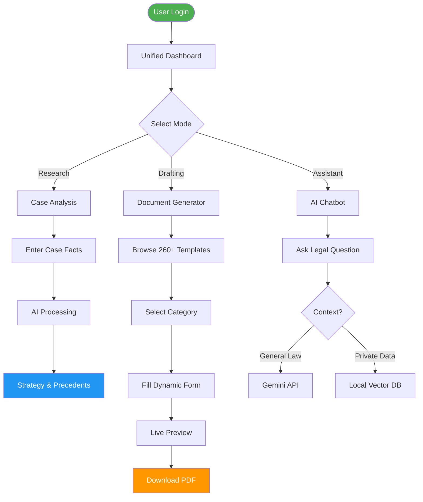

### 2. Component Interaction Diagram

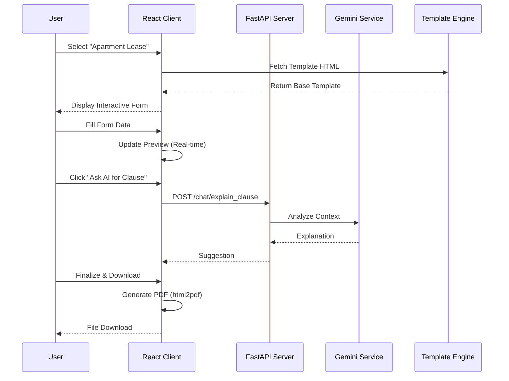

### 3. Template Processing Pipeline

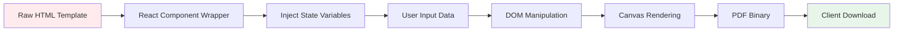

### 4. AI Integration Architecture

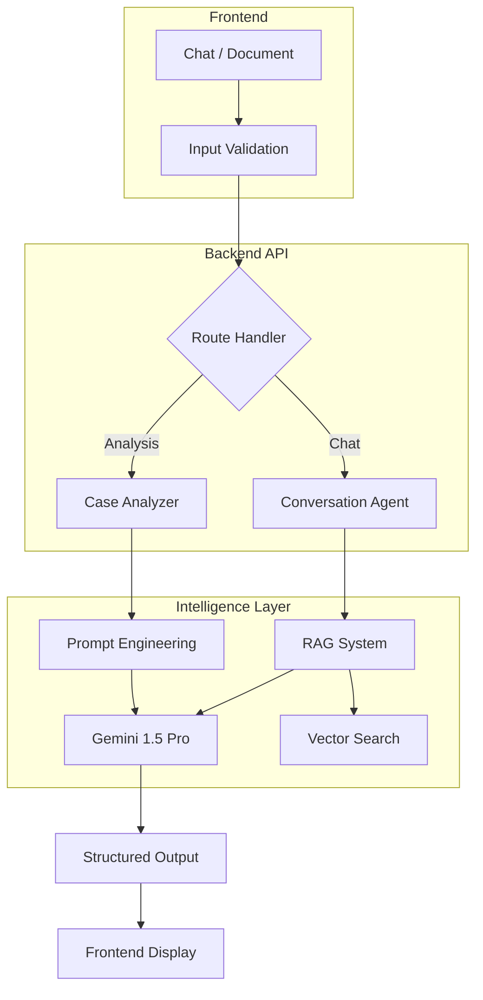

### 5. File Structure Hierarchy

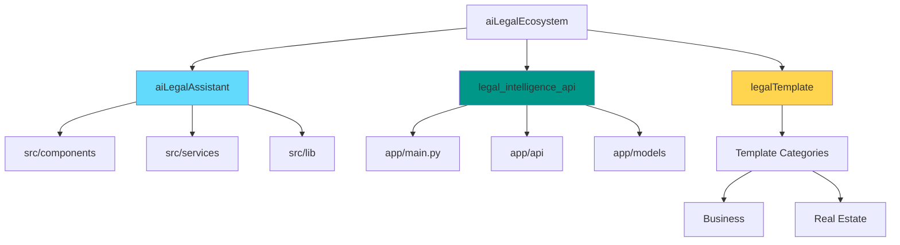

### 6. Security Architecture

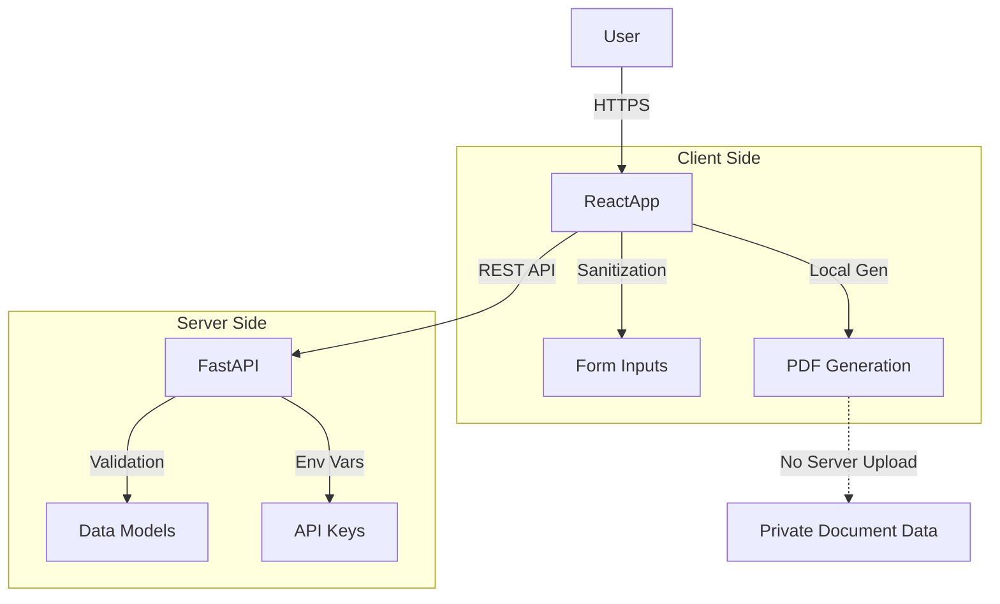

### 7. Deployment Architecture

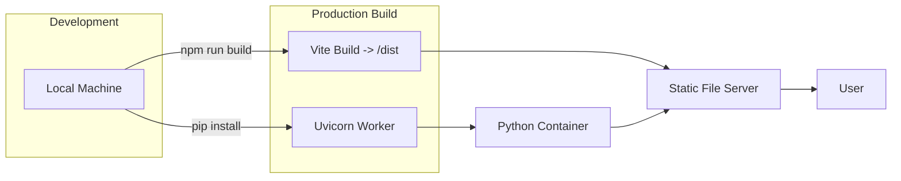

### 8. Template Category Distribution

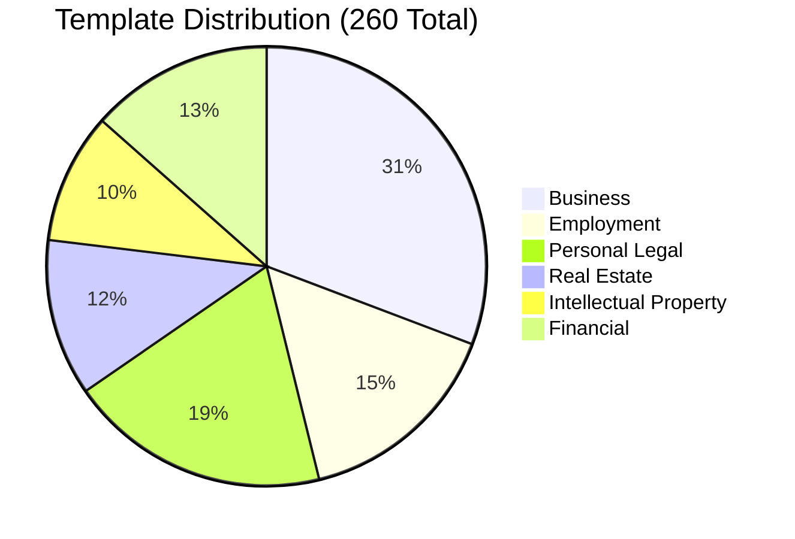

### 9. Error Handling Flow

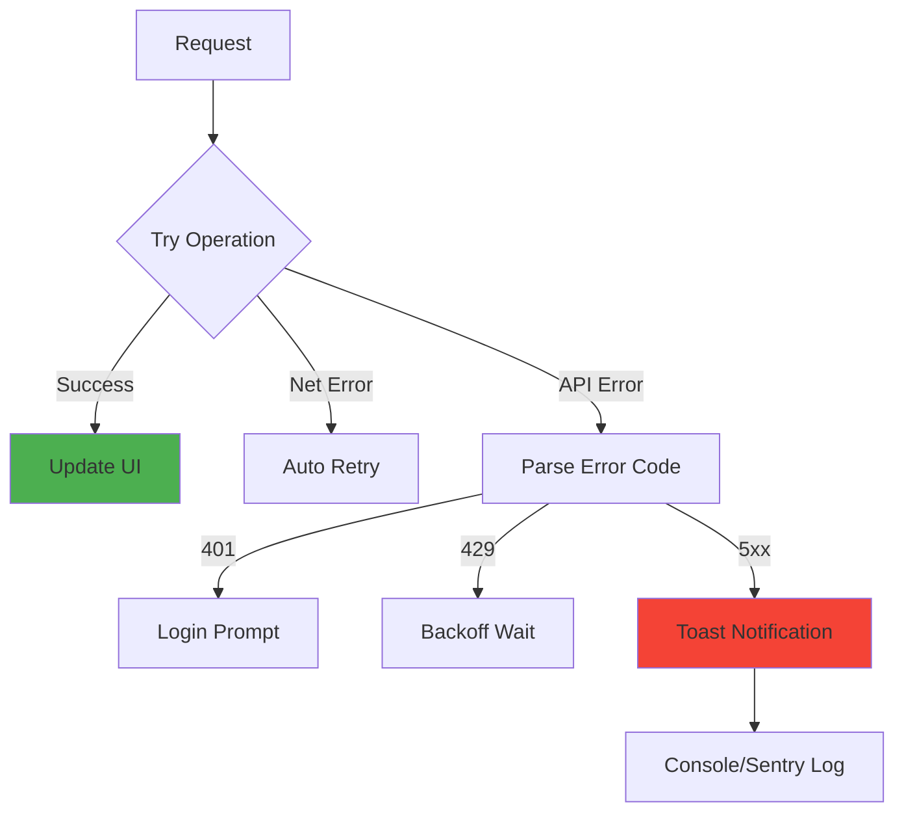

## 🛠️ Technology Stack


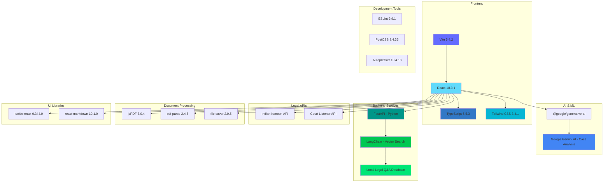


### Technology Details

#### Frontend Framework
- **React 18.3.1**: Modern UI library with hooks and concurrent features
- **TypeScript 5.5.3**: Type-safe JavaScript for better development experience
- **Vite 5.4.2**: Fast build tool and development server

#### Styling
- **Tailwind CSS 3.4.1**: Utility-first CSS framework
- **PostCSS 8.4.35**: CSS transformation tool
- **Autoprefixer 10.4.18**: Automatic vendor prefixing

#### AI Integration
- **Google Gemini AI**: Advanced language model for case analysis only
- **@google/generative-ai 0.24.1**: Official Gemini SDK

#### Backend Services
- **FastAPI**: High-performance Python web framework for the local API server
- **LangChain**: Vector search and retrieval for legal Q&A
- **Local Legal Database**: JSON-based legal Q&A datasets (IPC, Constitution, etc.)
- **Runs on**: localhost:8000

#### Legal Data Sources
- **Indian Kanoon API**: Comprehensive Indian case law database
- **Court Listener API**: US federal and state court decisions
- **Local Legal Intelligence API**: Privacy-focused local legal Q&A search

#### Document Processing
- **jsPDF 3.0.4**: PDF generation library
- **pdf-parse 2.4.5**: PDF text extraction
- **file-saver 2.0.5**: File download utility

#### UI Components
- **lucide-react 0.344.0**: Beautiful icon library
- **react-markdown 10.1.0**: Markdown rendering

#### Backend Infrastructure
- **Supabase 2.57.4**: Backend-as-a-Service (configured for future use)

#### Development Tools
- **ESLint 9.9.1**: Code linting and quality
- **TypeScript ESLint 8.3.0**: TypeScript-specific linting rules

---

## 📥 Installation

### Prerequisites

- **Node.js**: Version 16.x or higher
- **npm**: Version 8.x or higher (comes with Node.js)
- **Git**: For cloning the repository

### Step-by-Step Installation

1. **Clone the Repository**
   ```bash
   git clone https://github.com/yourusername/aiLegalEcosystem.git
   cd aiLegalEcosystem/aiLegalAssistant
   ```

2. **Install Dependencies**
   ```bash
   npm install
   ```

3. **Configure Environment Variables**
   
   Create a `.env` file in the `aiLegalAssistant` directory:
   ```env
   VITE_GEMINI_API_KEY=your_gemini_api_key_here
   VITE_INDIAN_KANOON_TOKEN=your_indian_kanoon_token_here
   VITE_COURT_LISTENER_TOKEN=your_court_listener_token_here
   ```

4. **Start Development Server**
   ```bash
   npm run dev
   ```

5. **Build for Production**
   ```bash
   npm run build
   ```

6. **Preview Production Build**
   ```bash
   npm run preview
   ```

### Local Legal Intelligence API Setup

7. **Navigate to API Directory**
   ```bash
   cd ../legal_intelligence_api
   ```

8. **Install Python Dependencies**
   ```bash
   pip install -r requirements.txt
   ```

9. **Start the Local API Server**
   ```bash
   python main.py
   ```
   
   The API will run on `http://localhost:8000`

10. **Verify API is Running**
    - Open browser to `http://localhost:8000/health`
    - You should see: `{"status": "healthy"}`

---

## ⚙️ Configuration

### API Keys Setup

#### 1. Google Gemini API Key
- Visit [Google AI Studio](https://makersuite.google.com/app/apikey)
- Create a new API key
- Add to `.env` as `VITE_GEMINI_API_KEY`

#### 2. Indian Kanoon API Token
- Visit [Indian Kanoon API](https://api.indiankanoon.org/)
- Register for an API token
- Add to `.env` as `VITE_INDIAN_KANOON_TOKEN`

#### 3. Court Listener API Token
- Visit [Court Listener](https://www.courtlistener.com/api/)
- Create an account and generate API token
- Add to `.env` as `VITE_COURT_LISTENER_TOKEN`

### Environment Variables

| Variable | Description | Required |
|----------|-------------|----------|
| `VITE_GEMINI_API_KEY` | Google Gemini AI API key | Yes |
| `VITE_INDIAN_KANOON_TOKEN` | Indian Kanoon API token | Yes |
| `VITE_COURT_LISTENER_TOKEN` | Court Listener API token | Optional |

---

## 🚀 Usage

### 1. Case Analysis

1. Navigate to the **Analyze** tab
2. Fill in the case details:
   - **Facts**: Describe the case facts
   - **Parties**: List involved parties
   - **Issues**: Legal issues to be addressed
   - **Sections**: Applicable legal sections
   - **Stage**: Current case stage
3. Click **Analyze Case**
4. Review the analysis results:
   - Matched precedents
   - Case strength assessment
   - Strong and weak points
   - Expected direction
   - Legal advice

### 2. Local Legal Intelligence Search

1. **Ensure Local API is Running** at `http://localhost:8000`
2. Navigate to the **AI Assistant** tab
3. Type your legal query in the search field (e.g., "What is Section 302 IPC?")
4. The system will:
   - Search the local legal database
   - Return the top 2 most relevant Q&A pairs
   - Display questions and answers with relevance scores
5. Use voice input for hands-free searching
6. Click the speaker icon to hear answers read aloud
7. All data stays local - no external AI calls

### 3. Document Analysis

1. In the AI Chat interface, click the file upload icon
2. Select a legal document (PDF, DOCX, TXT)
3. Wait for the document to be processed
4. Review the AI-generated analysis:
   - Document type and purpose
   - Key legal points
   - Potential issues
   - Recommendations

### 4. Case Library

1. Navigate to the **Cases** tab
2. Browse previously analyzed cases
3. Use search functionality to find specific cases
4. Click on a case to view detailed analysis

### 5. Analytics Dashboard

1. Navigate to the **Stats** tab
2. View analysis statistics:
   - Total analyses performed
   - Success rate trends
   - Section-wise distribution
   - Timeline visualization

---

## 📚 API Documentation

### Gemini AI Service

#### `chatWithAI(messages)`
Sends a chat message to Gemini AI with conversation context.

**Parameters:**
- `messages`: Array of message objects with `role` and `content`

**Returns:** Promise<string> - AI response text

**Example:**
```typescript
const response = await chatWithAI([
  { role: 'user', content: 'What is Section 302 IPC?' }
]);
```

#### `analyzeLegalDocument(content)`
Analyzes a legal document using Gemini AI.

**Parameters:**
- `content`: string - Document text content

**Returns:** Promise<string> - Analysis result

**Example:**
```typescript
const analysis = await analyzeLegalDocument(documentText);
```

### Indian Kanoon Service

#### `indianKanoon.search(query, pagenum)`
Searches Indian case law database.

**Parameters:**
- `query`: string - Search query
- `pagenum`: number - Page number (default: 0)

**Returns:** Promise<IKSearchResponse>

**Example:**
```typescript
const results = await indianKanoon.search('Section 302 IPC murder', 0);
```

#### `indianKanoon.getDoc(tid)`
Retrieves a specific document by ID.

**Parameters:**
- `tid`: number - Document ID

**Returns:** Promise<object> - Document details

### Court Listener Service

#### `courtListener.search(query)`
Searches US court decisions.

**Parameters:**
- `query`: string - Search query

**Returns:** Promise<CLSearchResponse>

---

## 📁 Project Structure

```
aiLegalEcosystem/
├── aiLegalAssistant/           # Main React application
│   ├── src/
│   │   ├── components/         # React components
│   │   │   ├── AIChat.tsx
│   │   │   ├── CaseAnalysisResults.tsx
│   │   │   ├── CaseInputForm.tsx
│   │   │   ├── CaseLibrary.tsx
│   │   │   ├── ComparisonTable.tsx
│   │   │   ├── DocumentDrafting.tsx
│   │   │   ├── FileUploader.tsx
│   │   │   ├── Header.tsx
│   │   │   ├── LegalAnalyticsDashboard.tsx
│   │   │   ├── Sidebar.tsx
│   │   │   ├── TranslationSettings.tsx
│   │   │   └── WebSearchResults.tsx
│   │   ├── lib/                # Utility libraries
│   │   │   ├── gemini.ts
│   │   │   └── openai.ts
│   │   ├── services/           # API services
│   │   │   ├── api.ts          # Local API service
│   │   │   ├── courtListener.ts
│   │   │   └── indianKanoon.ts
│   │   ├── App.tsx             # Main application component
│   │   ├── main.tsx            # Application entry point
│   │   └── index.css           # Global styles
│   ├── public/                 # Static assets
│   ├── .env                    # Environment variables
│   ├── package.json            # Dependencies
│   ├── tsconfig.json           # TypeScript configuration
│   ├── tailwind.config.js      # Tailwind CSS configuration
│   └── vite.config.ts          # Vite configuration
├── legal_intelligence_api/     # Local Legal Intelligence API
│   ├── data/                   # Legal Q&A datasets
│   │   ├── ipc_qa.json         # Indian Penal Code Q&A
│   │   ├── constitution_qa.json # Constitution Q&A
│   │   └── ...                 # Other legal datasets
│   ├── main.py                 # FastAPI server
│   ├── requirements.txt        # Python dependencies
│   └── README.md               # API documentation
├── legalforms/                 # Legal form templates
├── legalTemplate/              # Legal document templates
├── LegalServicesPlatform/      # Additional legal services
├── README.md                   # This file
├── CONTRIBUTING.md             # Contribution guidelines
└── LICENSE                     # License file
```

---

## 🤝 Contributing

We welcome contributions from the community! Please read our [CONTRIBUTING.md](CONTRIBUTING.md) for guidelines on how to contribute to this project.

### Quick Start for Contributors

1. Fork the repository
2. Create a feature branch (`git checkout -b feature/AmazingFeature`)
3. Commit your changes (`git commit -m 'Add some AmazingFeature'`)
4. Push to the branch (`git push origin feature/AmazingFeature`)
5. Open a Pull Request

---

## 📄 License

This project is licensed under the MIT License - see the [LICENSE](LICENSE) file for details.

---

## 🙏 Acknowledgments

- **Google Gemini AI** for providing advanced AI capabilities
- **Indian Kanoon** for comprehensive Indian case law database
- **Court Listener** for US court decision access
- **React Community** for excellent documentation and support
- **Open Source Contributors** for various libraries used in this project

---

## 📞 Contact & Support

- **Issues**: [GitHub Issues](https://github.com/yourusername/aiLegalEcosystem/issues)
- **Discussions**: [GitHub Discussions](https://github.com/yourusername/aiLegalEcosystem/discussions)
- **Email**: support@ailegalecosystem.com

---

## 🗺️ Roadmap

- [ ] Multi-language support for international legal systems
- [ ] Advanced analytics with machine learning insights
- [ ] Real-time collaboration features
- [ ] Mobile application development
- [ ] Integration with more legal databases
- [ ] Enhanced document generation capabilities
- [ ] User authentication and cloud storage
- [ ] API for third-party integrations

---

<div align="center">

**Made with ❤️ for the Legal Community**

⭐ Star us on GitHub — it helps!

[Report Bug](https://github.com/yourusername/aiLegalEcosystem/issues) • [Request Feature](https://github.com/yourusername/aiLegalEcosystem/issues)

</div>
