# Legal Document Management System

A comprehensive web-based platform for creating, managing, and downloading legal documents with AI-powered assistance.


## 📋 Table of Contents

- [Overview](#overview)
- [Features](#features)
- [Project Architecture](#project-architecture)
- [Directory Structure](#directory-structure)
- [Technologies Used](#technologies-used)
- [Installation](#installation)
- [Usage](#usage)
- [Scripts](#scripts)
- [Contributing](#contributing)

## 🎯 Overview

This Legal Document Management System is a full-stack web application that provides users with access to 260+ legal document templates. The platform includes features for document customization, PDF generation, AI-powered legal assistance, and comprehensive document management.

## ✨ Features

### Core Features
- **260+ Legal Templates**: Comprehensive collection of attorney-drafted legal documents
- **Dynamic Form Generation**: Interactive forms for document customization
- **PDF Export**: Client-side PDF generation using html2pdf.js
- **AI Legal Assistant**: Integrated Gemini AI for legal document analysis and chat support
- **Document Preview**: Real-time preview of customized documents
- **Responsive Design**: Mobile-friendly interface with modern UI/UX

### AI Features
- **Chat Interface**: Interactive AI chat for legal queries
- **Document Analysis**: Upload and analyze legal documents
- **Context-Aware Responses**: AI understands legal terminology and context
- **File Upload Support**: Analyze PDFs, Word documents, and images

### Document Management
- **Template Categories**: Organized by business, personal, real estate, etc.
- **Search & Filter**: Easy document discovery
- **Customization**: Fill-in-the-blank forms with validation
- **eSignature Support**: Digital signature capabilities

## 🛠️ Technologies Used

### Frontend
- **HTML5/CSS3**: Modern semantic markup and styling
- **JavaScript (ES6+)**: Client-side interactivity
- **html2pdf.js**: PDF generation
- **Responsive Design**: Mobile-first approach

### Backend
- **Node.js**: Server runtime
- **Express.js**: Web framework
- **Multer**: File upload handling
- **Google Gemini AI**: AI-powered assistance

### Development Tools
- **Python**: Automation scripts
- **PowerShell**: Asset management
- **Git**: Version control

## 🚀 Installation

### Prerequisites
- Node.js (v14 or higher)
- npm or yarn
- Python 3.x (for utility scripts)

### Steps

1. **Clone the repository**
   ```bash
   git clone https://github.com/quantumNexus0/aiLegalEcosystem.git
   cd aiLegalEcosystem
   ```

2. **Install backend dependencies**
   ```bash
   cd projectAIlegal
   npm install
   ```

3. **Set up environment variables**
   ```bash
   # Create .env file in projectAIlegal/
   GEMINI_API_KEY=your_gemini_api_key_here
   PORT=3000
   ```

4. **Start the server**
   ```bash
   npm start
   ```

5. **Access the application**
   - Open browser to `http://localhost:3000`
   - Browse templates at `www.legalzoom.com/legalTemplate/t/`

## 📖 Usage

### Creating a Legal Document

1. **Browse Templates**: Navigate to the templates directory
2. **Select Template**: Choose from 260+ legal documents
3. **Fill Form**: Complete the interactive form fields
4. **Preview**: Review your customized document
5. **Download**: Generate and download PDF

### Using AI Assistant

1. **Open Chat**: Click on the AI chat interface
2. **Ask Questions**: Type legal questions or upload documents
3. **Get Analysis**: Receive AI-powered insights
4. **Refine**: Continue conversation for clarifications

### Example Templates
- Business Agreements
- Employment Contracts
- Real Estate Documents
- Partnership Agreements
- Non-Disclosure Agreements
- Power of Attorney
- And 250+ more...
---
# Project Architecture Diagrams

## 1. System Architecture Overview

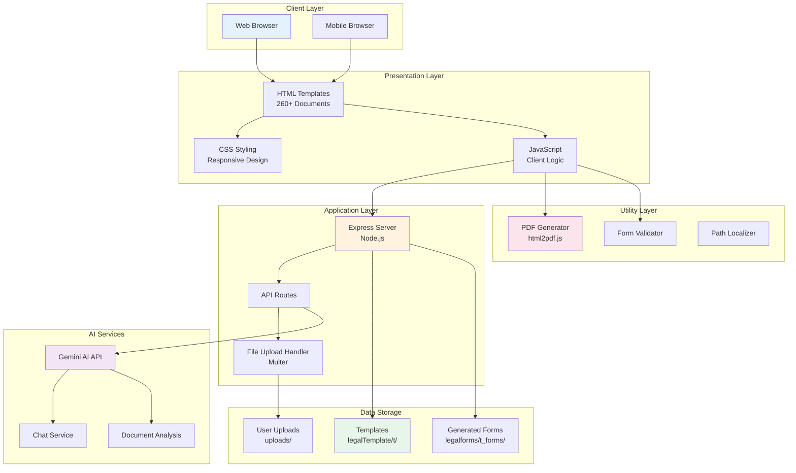

## 2. User Journey Flow

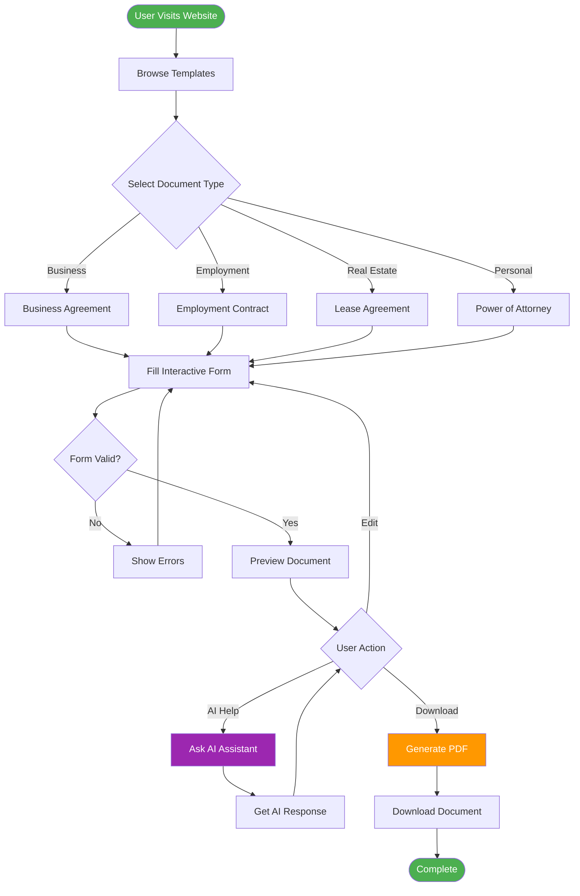

## 3. Data Flow Diagram

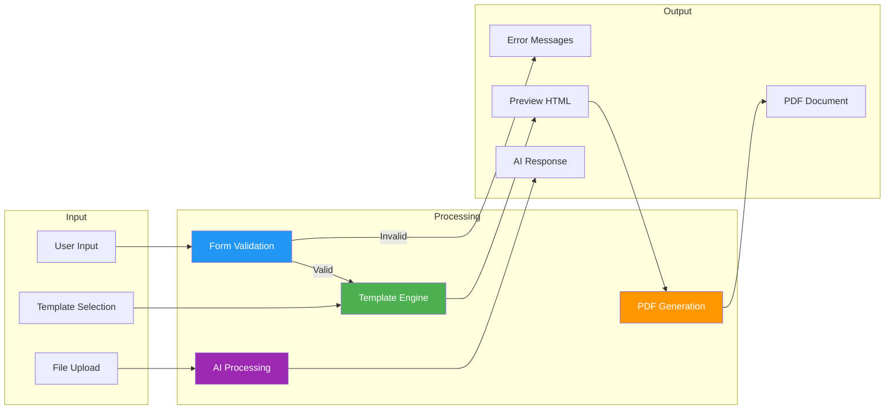

## 4. Component Interaction Diagram

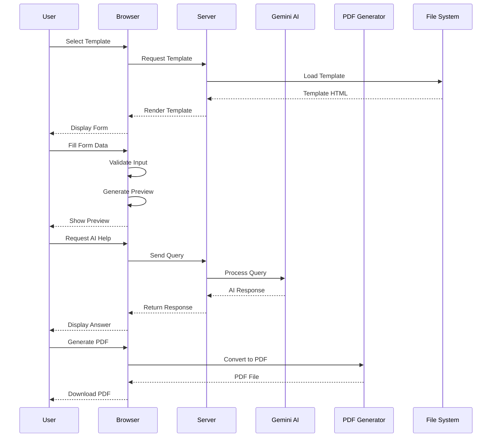

## 5. Template Processing Pipeline

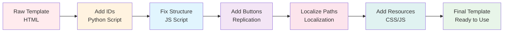

## 6. AI Integration Architecture

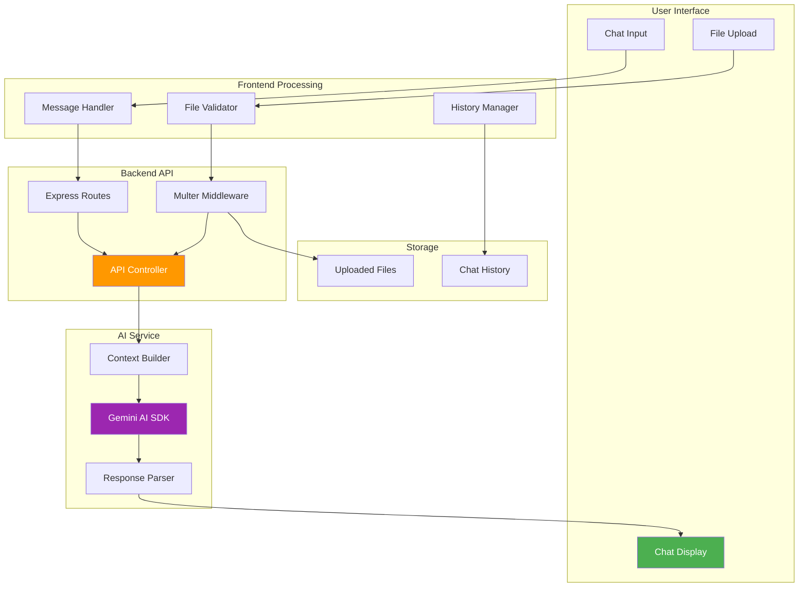

## 7. File Structure Hierarchy

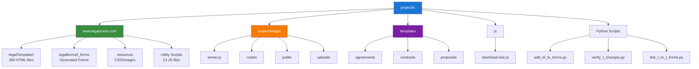

## 8. Security Architecture

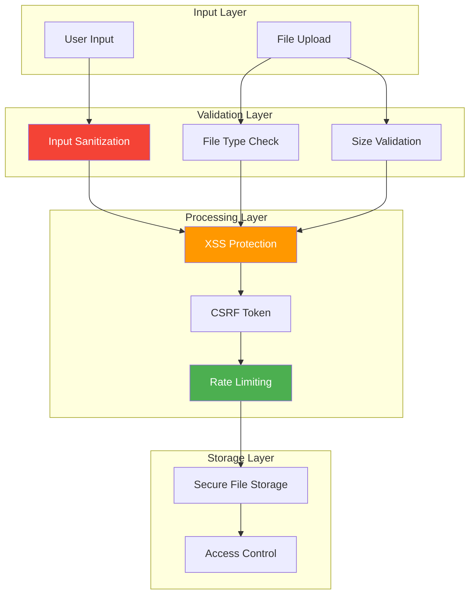

## 9. Deployment Architecture

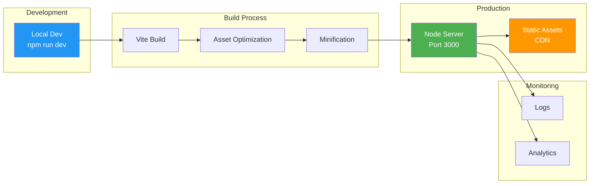

## 10. Template Category Distribution

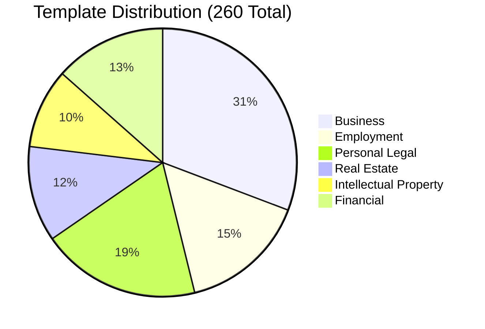

## 11. Technology Stack

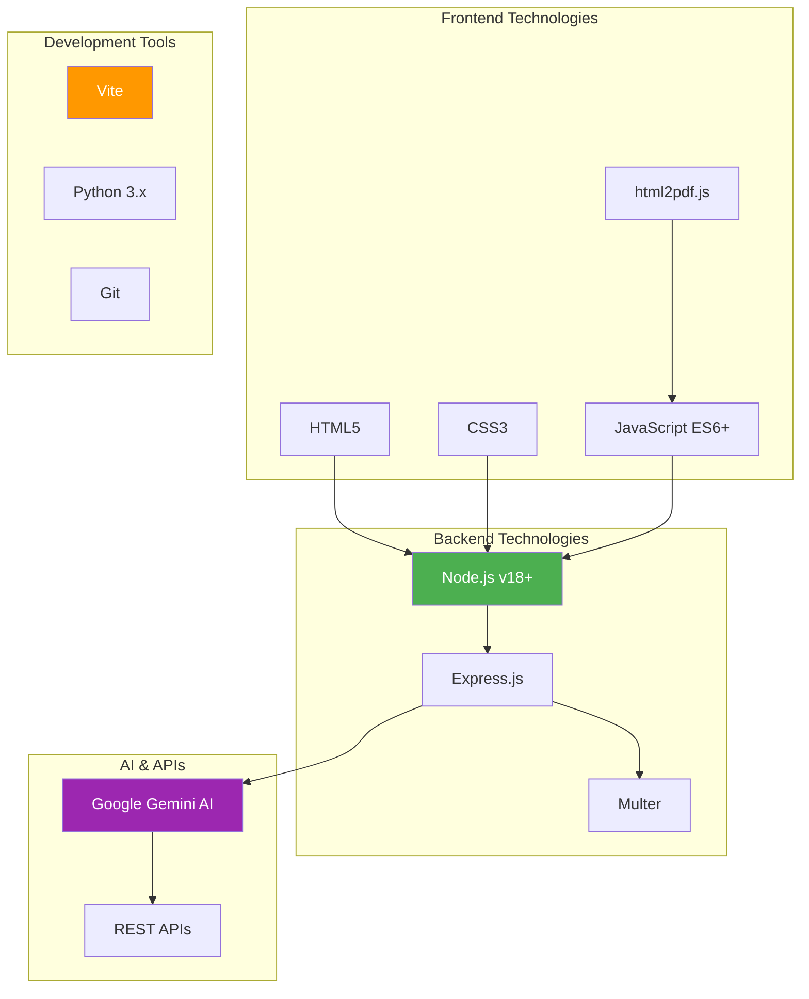

## 12. Error Handling Flow

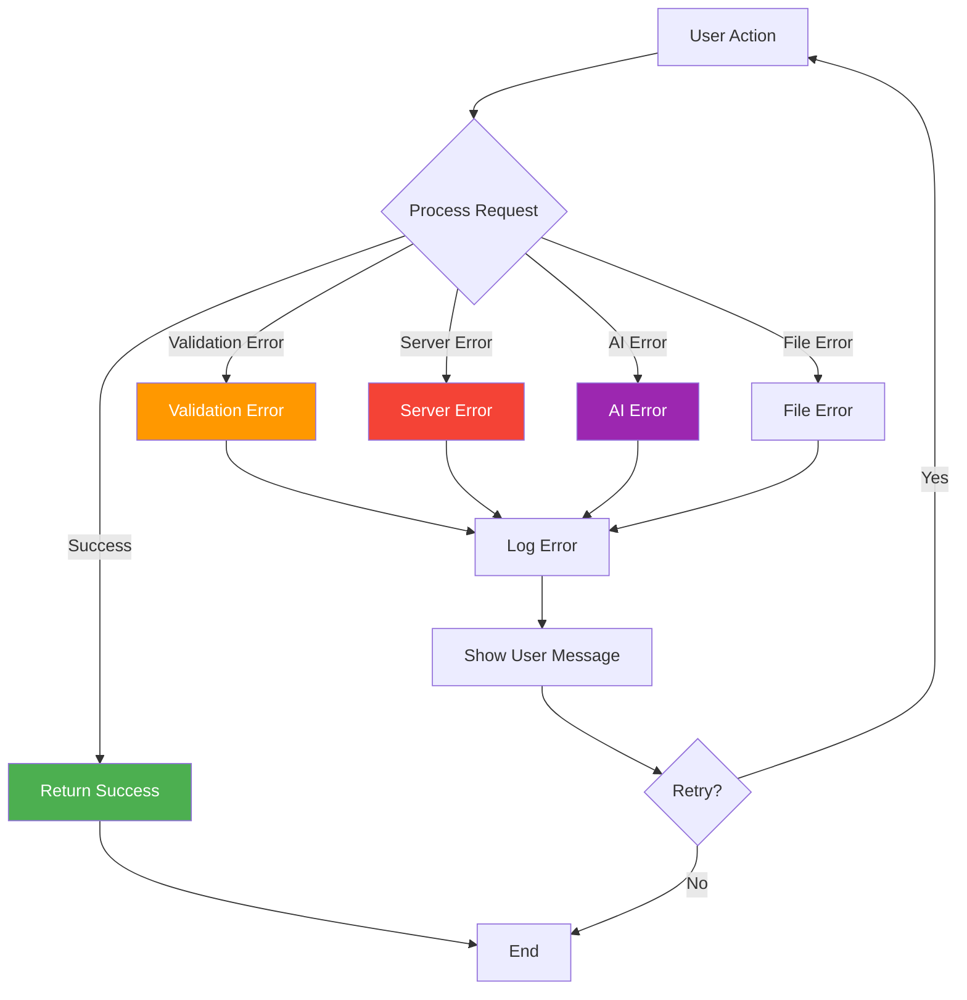
