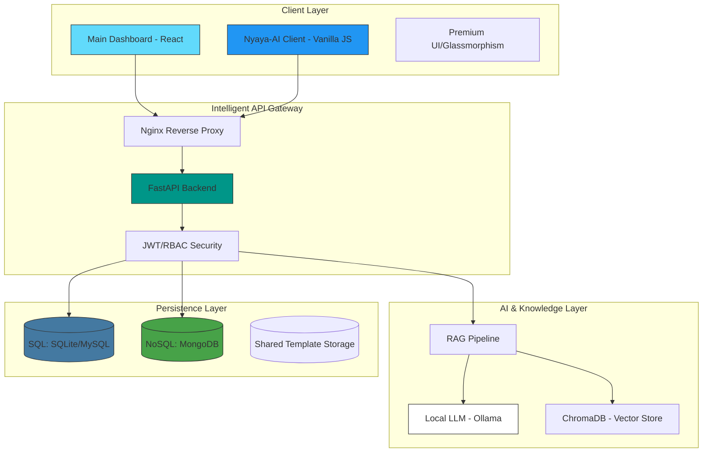

# Nyaya-AI - Unified Legal Intelligence Ecosystem 🏛️⚖️

<div align="center">


**Nyaya-AI is a state-of-the-art, privacy-prioritized legal ecosystem designed for the Indian legal landscape. It seamlessly connects citizens with legal professionals while providing powerful local AI tools for case analysis, document drafting, and legal research.**

[Features](#-key-features) • [Architecture](#-system-architecture) • [Getting Started](#-getting-started) • [Docker Deployment](#-docker-setup-recommended) • [Contributing](#-contributing)

</div>

---

## 📋 Table of Contents

- [Overview](#-overview)
- [Key Features](#-key-features)
- [System Architecture](#-system-architecture) (See also: [Deep Dive Architecture Diagrams](ARCHITECTURE.md))
- [Integrated Ecosystem Components](#-integrated-ecosystem-components)
- [Technology Stack](#-technology-stack)
- [Getting Started](#-getting-started)
- [Docker Setup](#-docker-setup-recommended)
- [Security & Privacy](#-security--privacy)
- [Contributing](#-contributing)
- [License](#-license)

---

## 🌟 Overview

**Nyaya-AI** bridges the gap between complex legal processes and accessible justice. By unifying practice management for lawyers with an intelligent, local AI assistant for citizens, the platform creates a complete digital legal cycle.

- **For Citizens**: Access "Nyaya-AI Assistant" for instant, context-aware legal guidance and case analysis without compromising data privacy.
- **For Lawyers**: Manage cases, clients, and appointments through a premium, role-based dashboard.
- **For Admins**: Oversite and platform governance with real-time analytics.

---

## ✨ Key Features

### 1. **Integrated Nyaya-AI Assistant** 🤖
- **Local AI (Ollama)**: High-performance legal intelligence running entirely on your local machine.
- **Context-Aware RAG**: Advanced Retrieval Augmented Generation using **ChromaDB** to analyze your personal legal documents.
- **Legal Knowledge Base**: Instant access to Indian statutes, criminal jurisprudence, and landmark judgments.

### 2. **Professional Legal Management** 💼
- **Role-Based Dashboards**: Tailored experiences for Clients, Lawyers, and Administrators.
- **Premium Navigation**: Fully responsive, glassmorphic UI optimized for mobile, tablet, and desktop.
- **Lawyer Approval System**: Secure vetting process for legal professionals joining the platform.

### 3. **Smart Practice Tools** 🛠️
- **Intelligent Case Tracking**: Real-time status updates and hearing schedule management.
- **WebSocket Chat**: High-speed, secure messaging between legal professionals and clients.
- **Template Portal**: Direct access to a repository of legal document templates managed by the backend.

### 4. **Hybrid Intelligence Architecture** 🗄️
- **Relational Integrity**: SQL (SQLite/MySQL) for structured cases, appointments, and user data.
- **Document Intelligence**: MongoDB for storing complex AI analysis logs and document metadata.
- **Vector Search**: ChromaDB for lighting-fast semantic search across legal datasets.

---

## 🏗️ System Architecture

Nyaya-AI operates as a unified multi-service ecosystem:


```mermaid
graph TB
    subgraph "Client Layer"
        Platform[Main Dashboard - React]
        Assistant[Nyaya-AI Client - Vanilla JS]
        Style[Premium UI/Glassmorphism]
    end

    subgraph "Intelligent API Gateway"
        FastAPI[FastAPI Backend]
        Auth[JWT/RBAC Security]
        Proxy[Nginx Reverse Proxy]
    end

    subgraph "AI & Knowledge Layer"
        Ollama[Local LLM - Ollama]
        VectorDB[ChromaDB - Vector Store]
        LocalRAG[RAG Pipeline]
    end

    subgraph "Persistence Layer"
        SQL[(SQL: SQLite/MySQL)]
        NoSQL[(NoSQL: MongoDB)]
        Shared[(Shared Template Storage)]
    end

    Platform --> Proxy
    Assistant --> Proxy
    Proxy --> FastAPI
    
    FastAPI --> Auth
    Auth --> SQL
    Auth --> NoSQL
    Auth --> LocalRAG
    
    LocalRAG --> VectorDB
    LocalRAG --> Ollama
    
    style Platform fill:#61DAFB,stroke:#333
    style Assistant fill:#2196f3,stroke:#333
    style FastAPI fill:#009688,stroke:#333
    style Ollama fill:#ffffff,stroke:#333
    style SQL fill:#4479A1,stroke:#333
    style NoSQL fill:#47A248,stroke:#333
```

---

## 📦 Integrated Ecosystem Components

### 1. Main Platform
The core web portal for user management and practice tools.
- **Directory**: `client/platform/`
- **Port**: `5173`
- **Tech**: React, TypeScript, Tailwind CSS, Framer Motion.

### 2. Nyaya-AI Assistant
A specialized, lightweight interface for legal research and case analysis.
- **Directory**: `client/nyaya-ai/`
- **Port**: `5174`
- **Tech**: HTML5, Vanilla JavaScript, CSS3.

### 3. Unified Backend API
A high-performance FastAPI server powering all ecosystem features.
- **Directory**: `server/`
- **Port**: `8000`
- **Tech**: Python 3.11+, SQLAlchemy, ChromaDB, Ollama SDK.

---

## 🚀 Getting Started

### Prerequisites
- **Node.js** (v18+)
- **Python** (v3.10+)
- **Ollama** (Installed and running for AI features)
- **Git**

### Installation

1. **Clone the repository**:
   ```bash
   git clone https://github.com/quantumNexus0/ai_legal_ecosystem.git
   cd ai_legal_ecosystem
   ```

2. **Run the Setup Script**:
   This will install all frontend and backend dependencies across the ecosystem.
   ```bash
   npm run install:all
   ```

3. **Configure Environment**:
   - Create a `.env` in `server/` (see `server/.env.example`).
   - Ensure Ollama is running (`ollama serve`).

4. **Launch the Ecosystem**:
   The ecosystem uses a concurrent runner to start all three primary services simultaneously.
   ```bash
   npm run dev
   ```
   - **Platform**: `http://localhost:5173`
   - **Assistant**: `http://localhost:5174`
   - **Backend**: `http://localhost:8000`

---

## 🐳 Docker Setup (Recommended)

The entire ecosystem is containerized for professional deployment. Our configuration includes multi-stage builds and a unified nginx reverse proxy.

```bash
# Build and start the entire stack
docker compose up -d --build

# Status check
docker compose ps
```

**Services in Docker:**
- `platform`: Main UI (Port 80)
- `nyaya-ai`: AI Client (Port 5174)
- `server`: API Gateway (Port 8000)
- `mongodb`: High-performance NoSQL store (Port 27018)

---

## 🛡️ Security & Privacy

Nyaya-AI is built with **Privacy-First** principles:
- **Local Inference**: AI Case Analysis happens locally via Ollama; your legal facts never leave your server.
- **Local Vector Search**: Document embeddings are stored locally in ChromaDB.
- **RBAC**: Strict Role-Based Access Control ensures users only see the data they own.

---

## 📑 License

This project is licensed under the MIT License - see the [LICENSE](LICENSE) file for details.

© 2026 Nyaya-AI Ecosystem. All Rights Reserved.
