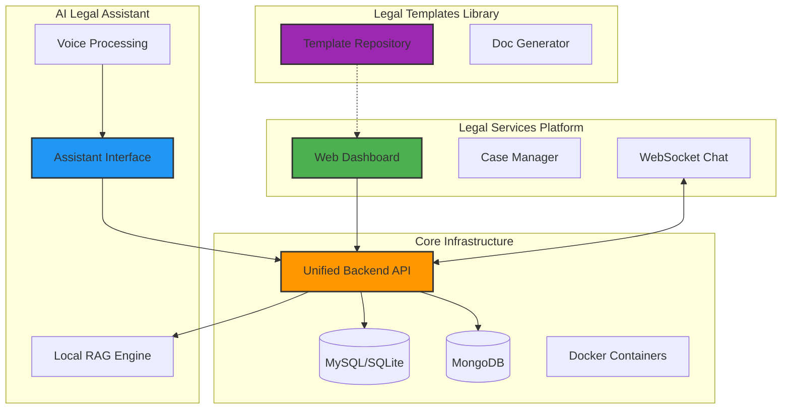
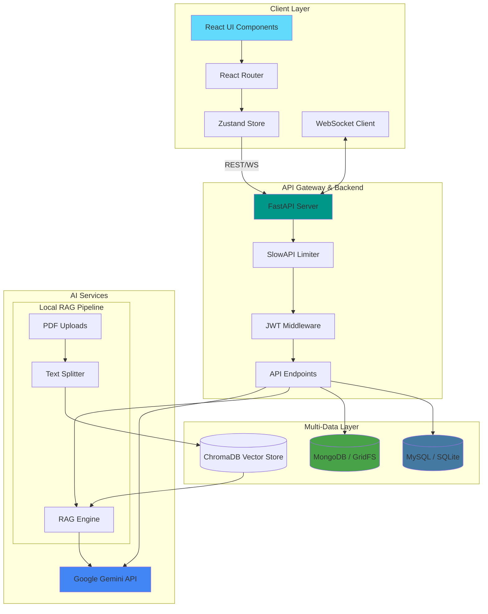
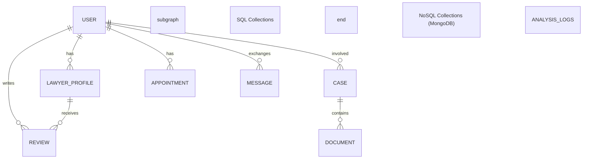
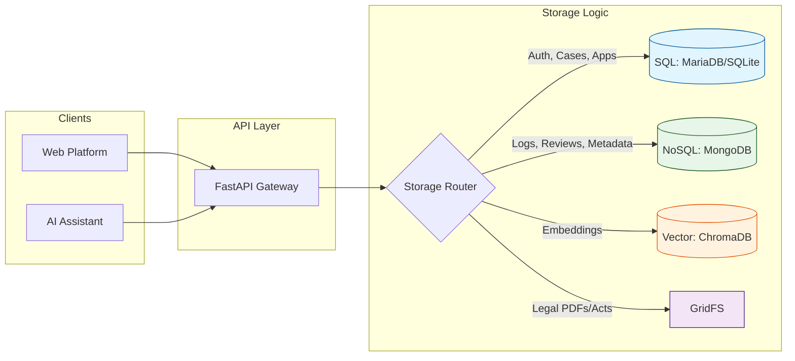
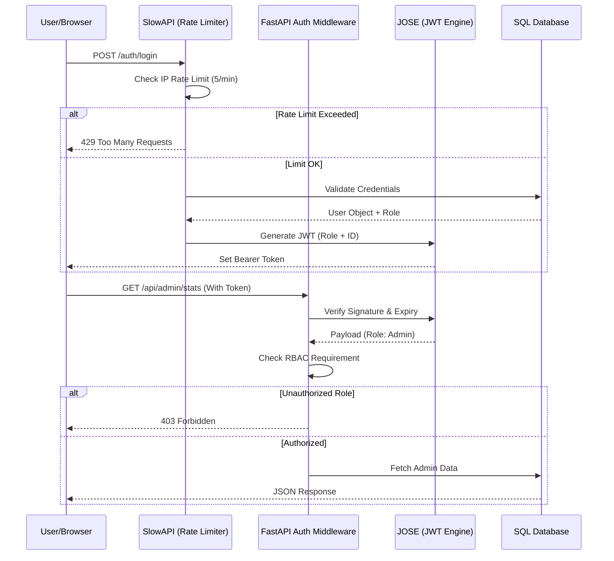
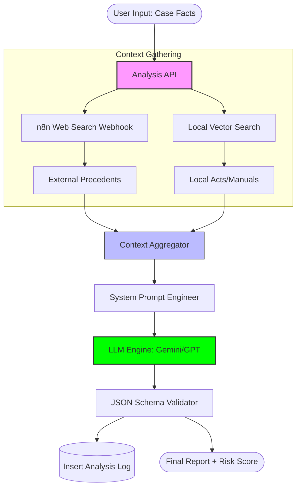
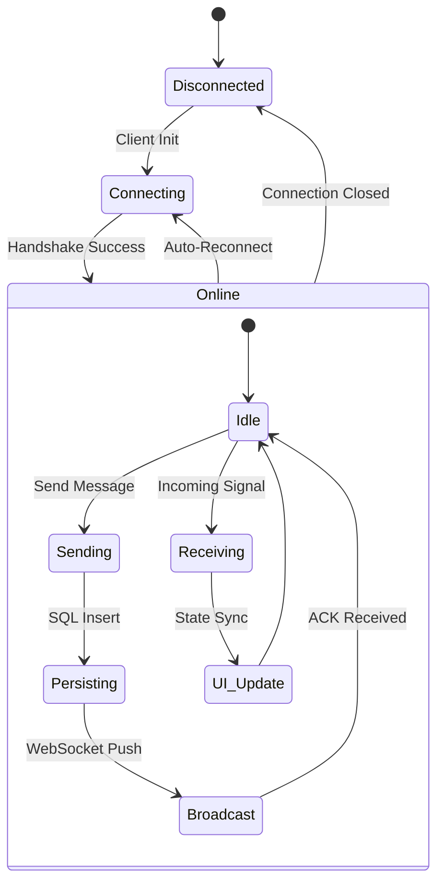
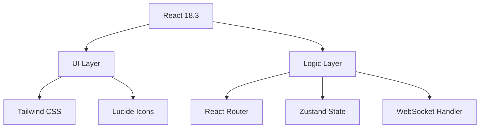
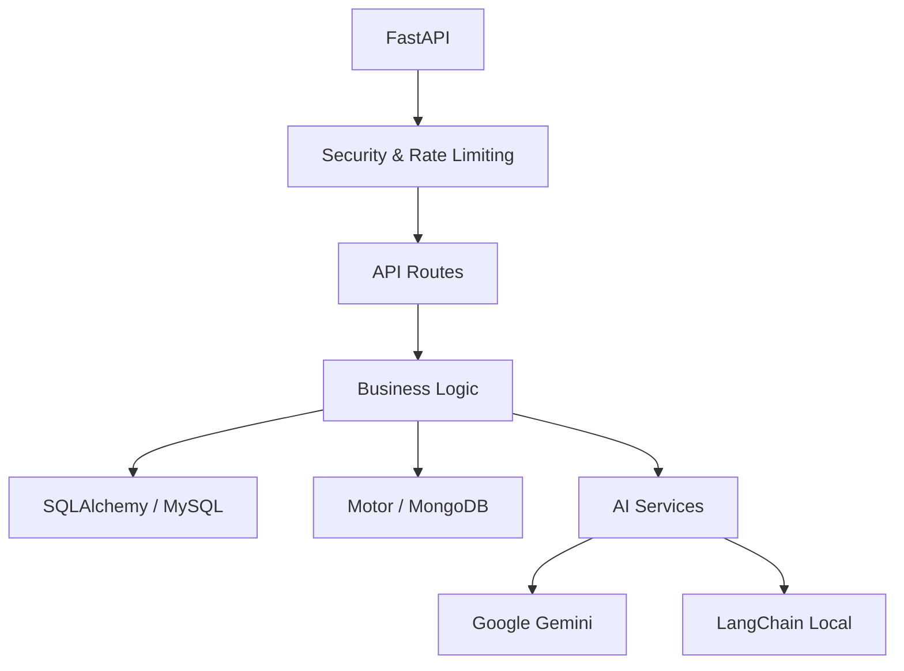

# NyayaAssist - AI Legal Ecosystem 🏛️⚖️

<div align="center">


**NyayaAssist - India's premier AI-powered legal platform connecting citizens with verified lawyers. Comprehensive legal research, real-time messaging, intelligent case management, and seamless appointment scheduling.**

[Features](#-features) • [Architecture](#-system-architecture) • [Installation](#-installation) • [Usage](#-usage) • [Contributing](#-contributing)

</div>

---

## 📋 Table of Contents

- [Overview](#-overview)
- [Features](#-features)
- [Ecosystem Overview (ERP View)](#-ecosystem-overview-erp-view)
- [System Architecture](#-system-architecture)
- [Entity Relationship Diagram](#-entity-relationship-diagram)
- [Detailed Component Diagrams](#-detailed-component-diagrams)
- [Module Details](#-module-details)
    - [Legal Services Platform](#1-legal-services-platform)
    - [Legal Templates Library](#2-legal-templates-library-legaltemplate)
    - [AI Legal Assistant](#3-ai-legal-assistant-ailegalassistant)
- [Technology Stack](#-technology-stack)
- [Installation](#-installation)
- [Contributing](#-contributing)
- [License](#-license)

---

## 🌟 Overview

**AI Legal Ecosystem** is a unified legal technology platform that bridges the gap between legal professionals and citizens. It combines advanced AI for case analysis with robust practice management tools for lawyers.

For **Citizens**, it offers AI-driven legal insights, easy access to verified lawyers, and a simple way to manage their legal journey.
For **Lawyers**, it provides a comprehensive dashboard to manage cases, appointments, client communications, and specialized profiles.

---

## ✨ Features

### 1. **Role-Based Dashboards**
- **User Dashboard**: Track your legal cases, view upcoming appointments, and manage lawyer communications.
- **Lawyer Dashboard**: Specialized interface for practice management, case tracking, and client interactions.
- **Admin Dashboard**: System-wide oversight of users, lawyers, and platform metrics with real-time stats.
- **Lawyer Approval System**: Unified interface for admins to review and approve/reject new lawyer registrations.

### 2. **Intelligent Case Management**
- **Create & Manage**: Lawyers can create new client files, track case status, and update details.
- **Visibility**: Clients get real-time visibility into their case progress and hearing dates.

### 3. **Dual-Database Intelligence** 🗄️
- **SQL (MySQL/SQLite)**: Robust storage for structured data like Users, Cases, and Appointments.
- **NoSQL (MongoDB)**: High-performance storage for AI analysis logs, client reviews, and binary document storage (GridFS).
- **Fast Fallback**: Intelligent backend that switches to SQLite instantly if MySQL is unavailable.

### 4. **AI Case Analysis Engine** 🧠
- **Precedent Matching**: Input case facts to find relevant legal precedents using AI.
- **Analysis History**: Automatically saves all AI analyses to MongoDB for future reference.
- **Strategy Generation**: AI-identified legal advice, risk scores, and tactical next steps.

### 5. **Real-Time Messaging & WebSockets** 💬
- **WebSocket Chat**: High-speed, bidirectional communication between lawyers and clients.
- **Online Status**: Real-time tracking of which users are currently active.
- **Persistent History**: All conversations are saved securely in the SQL database.

### 6. **Legal Document Management** 📄
- **GridFS Storage**: Securely upload and manage legal PDFs and documents in MongoDB.
- **Case Linking**: Directly associate uploaded files with specific cases.

### 7. **Client Feedback System** ⭐
- **Reviews & Ratings**: Clients can rate and review lawyers after appointments.
- **Dynamic Scoring**: Lawyer ratings are automatically recalculated based on client feedback.

### 8. **Local Legal Assistant (RAG)** 🤖
- **Privacy-First**: Chat with your local PDF documents using ChromaDB and Gemini.
- **Structured Insights**: AI responses are formatted into clear Titles, Definitions, and Key Points.
- **Voice Support**: Hands-free voice input and text-to-speech output.

---

## 🌐 Ecosystem Overview (ERP View)


```mermaid
graph TB
    subgraph "Core Infrastructure"
        Backend[Unified Backend API]
        SQL[(MySQL/SQLite)]
        NoSQL[(MongoDB)]
        Docker[Docker Containers]
    end

    subgraph "Legal Services Platform"
        Dashboard[Web Dashboard]
        CaseMgr[Case Manager]
        Chat[WebSocket Chat]
    end

    subgraph "AI Legal Assistant"
        AssistantUI[Assistant Interface]
        Voice[Voice Processing]
        LocalRAG[Local RAG Engine]
    end

    subgraph "Legal Templates Library"
        TemplateLib[Template Repository]
        Generator[Doc Generator]
    end

    Dashboard --> Backend
    AssistantUI --> Backend
    TemplateLib -.-> Dashboard
    
    Backend --> SQL
    Backend --> NoSQL
    Backend --> LocalRAG
    
    Chat <--> Backend
    Voice --> AssistantUI
    
    style Backend fill:#ff9800,stroke:#333,stroke-width:2px
    style Dashboard fill:#4caf50,stroke:#333,stroke-width:2px
    style AssistantUI fill:#2196f3,stroke:#333,stroke-width:2px
    style TemplateLib fill:#9c27b0,stroke:#333,stroke-width:2px
```

---

## 📦 Module Details

### 1. Legal Services Platform
The core web application connecting lawyers and clients. Handles auth, dashboards, and real-time messaging.
- **Directory**: `client/platform/`
- **Tech**: React, TypeScript, Tailwind CSS, WebSockets.

### 2. AI Legal Assistant
A standalone interface for answering legal queries and analyzing documents via RAG.
- **Directory**: `client/assistant/`
- **Tech**: React, Local Vector DB, Web Speech API.

### 3. Unified Backend
Shared API powering the entire ecosystem with a focus on high availability.
- **Directory**: `server/`
- **Tech**: FastAPI, Python, SQLAlchemy, Motor (Async MongoDB).
- **Features**: Rate limiting (`slowapi`), JWT Auth, GridFS file management.

---

## 🏗️ System Architecture


```mermaid
graph TB
    subgraph "Client Layer"
        UI[React UI Components]
        Router[React Router]
        State[Zustand Store]
        WS[WebSocket Client]
    end

    subgraph "API Gateway & Backend"
        FastAPI[FastAPI Server]
        RateLimit[SlowAPI Limiter]
        Auth[JWT Middleware]
        Endpoints[API Endpoints]
    end

    subgraph "Multi-Data Layer"
        SQL[(MySQL / SQLite)]
        MongoDB[(MongoDB / GridFS)]
        VectorDB[(ChromaDB Vector Store)]
    end

    subgraph "AI Services"
        Gemini[Google Gemini API]
        subgraph "Local RAG Pipeline"
            PDF[PDF Uploads] --> Splitter[Text Splitter]
            Splitter --> VectorDB
            VectorDB --> RAG[RAG Engine]
        end
    end

    UI --> Router
    Router --> State
    State -- REST/WS --> FastAPI
    WS <--> FastAPI
    
    FastAPI --> RateLimit
    RateLimit --> Auth
    Auth --> Endpoints
    
    Endpoints --> SQL
    Endpoints --> MongoDB
    Endpoints --> RAG
    Endpoints --> Gemini
    
    RAG --> Gemini
    
    style UI fill:#61DAFB
    style FastAPI fill:#009688
    style SQL fill:#4479A1
    style MongoDB fill:#47A248
    style Gemini fill:#4285F4
```

---

## 📊 Entity Relationship Diagram


```mermaid
erDiagram
    USER ||--o{ LAWYER_PROFILE : has
    USER ||--o{ CASE : involved
    USER ||--o{ APPOINTMENT : has
    USER ||--o{ MESSAGE : exchanges
    USER ||--o{ REVIEW : writes
    
    LAWYER_PROFILE ||--o{ REVIEW : receives
    CASE ||--o{ DOCUMENT : contains
    
    subgraph "SQL Collections"
        USER
        LAWYER_PROFILE
        CASE
        APPOINTMENT
        MESSAGE
    end
    
    subgraph "NoSQL Collections (MongoDB)"
        REVIEW
        DOCUMENT
        ANALYSIS_LOGS
    end
```

---

## 🔬 Technical Deep Dive

### 1. Unified Data Lifecycle
This diagram illustrates how different types of data are routed through the multi-database ecosystem.


```mermaid
graph LR
    subgraph "Clients"
        Web[Web Platform]
        Asst[AI Assistant]
    end

    subgraph "API Layer"
        FastAPI[FastAPI Gateway]
    end

    subgraph "Storage Logic"
        RDR{Storage Router}
        SQL[(SQL: MariaDB/SQLite)]
        NoSQL[(NoSQL: MongoDB)]
        VDB[(Vector: ChromaDB)]
        GFS[GridFS]
    end

    Web --> FastAPI
    Asst --> FastAPI
    FastAPI --> RDR

    RDR -- "Auth, Cases, Apps" --> SQL
    RDR -- "Logs, Reviews, Metadata" --> NoSQL
    RDR -- "Legal PDFs/Acts" --> GFS
    RDR -- "Embeddings" --> VDB

    style SQL fill:#e1f5fe,stroke:#01579b
    style NoSQL fill:#e8f5e9,stroke:#1b5e20
    style VDB fill:#fff3e0,stroke:#e65100
    style GFS fill:#f3e5f5,stroke:#4a148c
```

### 2. JWT Authentication & Security Architecture
Comprehensive security flow including Rate Limiting and Role-Based Access Control (RBAC).


```mermaid
sequenceDiagram
    participant U as User/Browser
    participant SL as SlowAPI (Rate Limiter)
    participant FA as FastAPI Auth Middleware
    participant JWT as JOSE (JWT Engine)
    participant DB as SQL Database

    U->>SL: POST /auth/login
    SL->>SL: Check IP Rate Limit (5/min)
    alt Rate Limit Exceeded
        SL-->>U: 429 Too Many Requests
    else Limit OK
        SL->>DB: Validate Credentials
        DB-->>SL: User Object + Role
        SL->>JWT: Generate JWT (Role + ID)
        JWT-->>U: Set Bearer Token
    end

    U->>FA: GET /api/admin/stats (With Token)
    FA->>JWT: Verify Signature & Expiry
    JWT-->>FA: Payload (Role: Admin)
    FA->>FA: Check RBAC Requirement
    alt Unauthorized Role
        FA-->>U: 403 Forbidden
    else Authorized
        FA->>DB: Fetch Admin Data
        DB-->>U: JSON Response
    end
```

### 3. AI Analysis Synthesis Pipeline
How the system combines External Web Search, Local RAG, and LLM reasoning.


```mermaid
graph TD
    User([User Input: Case Facts]) --> API[Analysis API]
    
    subgraph "Context Gathering"
        API --> n8n[n8n Web Search Webhook]
        API --> RAG[Local Vector Search]
        n8n --> WebR[External Precedents]
        RAG --> LocalR[Local Acts/Manuals]
    end

    WebR --> Agg[Context Aggregator]
    LocalR --> Agg

    Agg --> Prompt[System Prompt Engineer]
    Prompt --> LLM[LLM Engine: Gemini/GPT]
    
    LLM --> Schema[JSON Schema Validator]
    Schema --> MongoDB[(Insert Analysis Log)]
    Schema --> Final([Final Report + Risk Score])

    style API fill:#f9f,stroke:#333,stroke-width:2px
    style LLM fill:#00ff00,stroke:#333,stroke-width:2px
    style Agg fill:#bbf,stroke:#333,stroke-width:1px
```

### 4. WebSocket Chat Lifecycle
Real-time state synchronization for the messaging module.


```mermaid
stateDiagram-v2
    [*] --> Disconnected
    Disconnected --> Connecting: Client Init
    Connecting --> Online: Handshake Success
    
    state Online {
        [*] --> Idle
        Idle --> Sending: Send Message
        Sending --> Persisting: SQL Insert
        Persisting --> Broadcast: WebSocket Push
        Broadcast --> Idle: ACK Received
        
        Idle --> Receiving: Incoming Signal
        Receiving --> UI_Update: State Sync
        UI_Update --> Idle
    }
    
    Online --> Disconnected: Connection Closed
    Online --> Connecting: Auto-Reconnect
```

---

## 🛠️ Technology Stack

### Frontend Components
Strictly typed React ecosystem with enhanced static checking.

```mermaid
graph TD
    React[React 18.3] --> UI[UI Layer]
    UI --> Tailwind[Tailwind CSS]
    UI --> Lucide[Lucide Icons]
    
    React --> Logic[Logic Layer]
    Logic --> Router[React Router]
    Logic --> Store[Zustand State]
    Logic --> WS[WebSocket Handler]
```

### Backend Structure

```mermaid
graph TD
    FastAPI[FastAPI] --> Security[Security & Rate Limiting]
    Security --> Routes[API Routes]
    Routes --> Controllers[Business Logic]
    
    Controllers --> SQL[SQLAlchemy / MySQL]
    Controllers --> NoSQL[Motor / MongoDB]
    
    Controllers --> AI[AI Services]
    AI --> Google[Google Gemini]
    AI --> LangChain[LangChain Local]
```

---

## 🚀 Installation & Execution

### Option A: Standard Setup (Manual)
1. **Node.js** (v18+), **Python** (v3.10+), and **XAMPP/MySQL**.
2. Clone and install root dependencies: `npm install`
3. Setup Python venv and activate it.
4. Run `npm run install:all` to setup frontend and backend.
5. Create a `.env` file in the `server/` directory (see `.env.example`).
6. Run `npm run dev` to start everything.

### Option B: Docker Setup (Recommended) 🐳
The entire ecosystem is containerized for instant deployment:
```bash
# Start all services (Backend, Frontend, MongoDB)
docker compose up -d --build

# Check running status
docker compose ps
```
- **Platform**: `http://localhost:5173`
- **Assistant**: `http://localhost:5174`
- **Backend**: `http://localhost:8000`

---

## ❓ FAQ & Troubleshooting

**Q: Can I run without XAMPP?**
A: Yes! The backend automatically falls back to **SQLite** if MySQL isn't detected. You can also use Docker to run MySQL inside a container.

**Q: What about MongoDB?**
A: MongoDB is required for advanced features (AI Logs, Reviews, Documents). Use `docker compose up -d mongodb` to start just the database.

**Q: Where is the API documentation?**
A: Visit `http://localhost:8000/docs` for the interactive Swagger UI.

---

## 📄 License
This project is licensed under the MIT License - see the [LICENSE](LICENSE) file for details.
