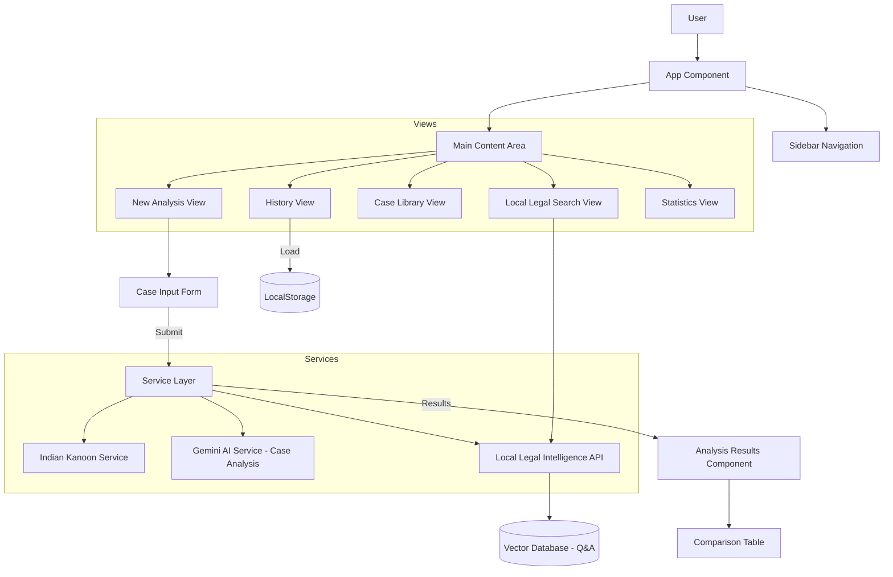
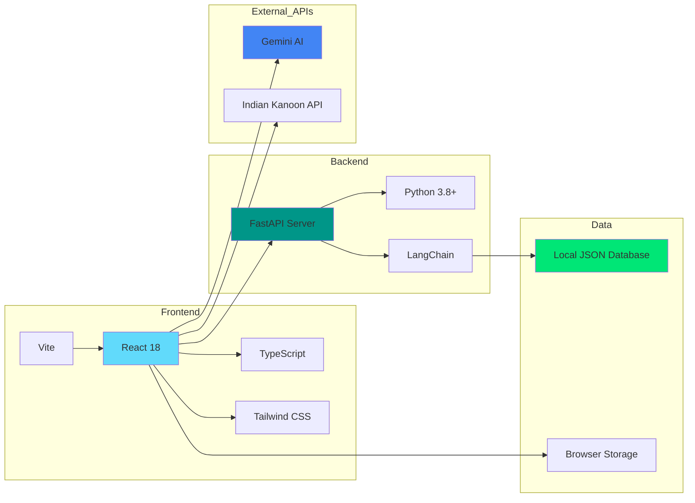
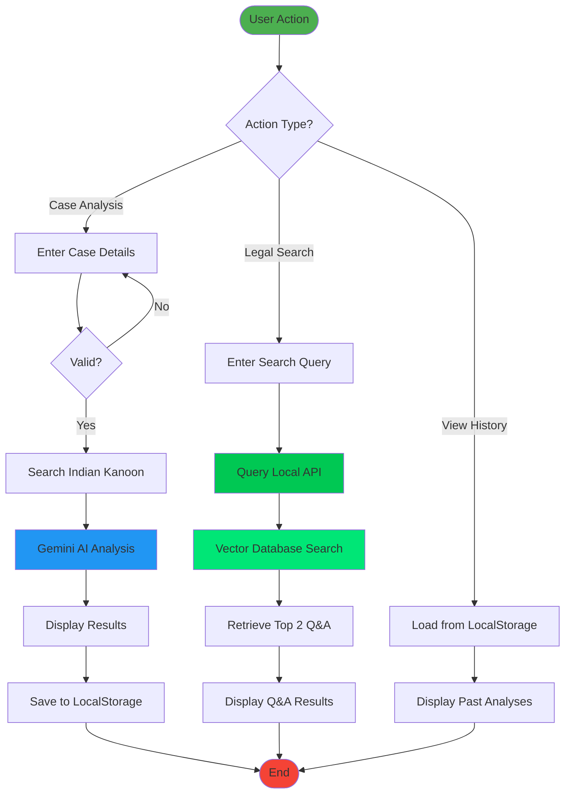
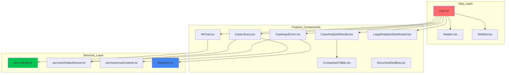

# AI Legal Case Analysis Platform

A modern, AI-powered web application designed to assist legal professionals and individuals in analyzing legal cases, finding precedents, and predicting outcomes.

## 🚀 Project Overview

This platform leverages advanced AI (Google Gemini for case analysis) and legal databases (Indian Kanoon, Local Legal Intelligence API) to provide deep insights into legal cases. It helps users understand the strength of their case, potential risks, and strategic moves based on historical data and local legal knowledge.

### Key Features

*   **⚖️ Intelligent Case Analysis**: Input case facts and issues to get a comprehensive analysis, including win probability and strategic advice.
*   **🔍 Local Legal Intelligence Search**: A dedicated search interface to query your local legal database with Q&A retrieval - no external AI calls, all data stays local.
*   **📚 Case Library**: Access a repository of relevant legal cases and precedents.
*   **📊 Legal Analytics Dashboard**: Visualize case history trends, including win probability over time and common risk factors.
*   **📜 History Management**: Automatically saves your analysis history for easy retrieval and review.
*   **🎙️ Voice Input & Text-to-Speech**: Hands-free searching with voice input and audio playback of answers.

## 🏗️ Architecture

The application follows a modern component-based architecture:

### System Architecture



### Technology Stack Diagram



### Data Flow Diagram



### Component Structure




## 🛠️ Technology Stack

### Frontend
*   **React 18**: Core UI library.
*   **TypeScript**: For type safety and robust development.
*   **Vite**: Fast build tool and development server.
*   **Tailwind CSS**: Utility-first CSS for styling.
*   **Lucide React**: Modern, lightweight icons.

### AI & Data
*   **Google Generative AI (Gemini)**: Powers the case analysis logic only.
*   **Local Legal Intelligence API**: FastAPI-based local server for privacy-focused legal Q&A search.
*   **Indian Kanoon API**: Integration for fetching real legal precedents.
*   **Vector Database**: LangChain-powered semantic search for local legal knowledge.

### Utilities
*   **jsPDF**: For generating PDF reports of case analyses.
*   **React Router**: Client-side routing.

## 🏁 Getting Started

### Prerequisites
*   Node.js (v18 or higher)
*   npm or yarn
*   Python (v3.8 or higher)
*   pip (Python package manager)

### Installation

1.  **Clone the repository**
    ```bash
    git clone https://github.com/yourusername/ai-legal-case.git
    cd ai-legal-case/aiLegalAssistant
    ```

2.  **Install dependencies**
    ```bash
    npm install
    ```

3.  **Environment Setup**
    Create a `.env` file in the root directory and add your API keys:
    ```env
    VITE_GEMINI_API_KEY=your_gemini_api_key
    VITE_INDIAN_KANOON_API_KEY=your_indian_kanoon_api_key
    ```

4.  **Set Up Local Legal Intelligence API**
    ```bash
    cd ../legal_intelligence_api
    pip install -r requirements.txt
    python main.py
    ```
    The API will run on `http://localhost:8000`

5.  **Run the development server** (in a new terminal)
    ```bash
    cd ../aiLegalAssistant
    npm run dev
    ```

## 📖 Usage Guide

1.  **New Analysis**: Navigate to the "New Analysis" tab. Enter the facts of your case, the legal issues, and relevant sections. Click "Analyze Case" to get a prediction.
2.  **View History**: Check the "History" tab to see all your past analyses. Click on any record to view the full details again.
3.  **Local Legal Search**: Use the "AI Assistant" tab to search your local legal database. Enter queries like "What is Section 302 IPC?" and get instant answers from your local knowledge base. Use voice input or text-to-speech for hands-free operation.
4.  **Analytics**: Visit the "Statistics" tab to see a dashboard of your case performance trends.

## 🤝 Contributing

Contributions are welcome! Please feel free to submit a Pull Request.

## 📄 License

This project is licensed under the MIT License.
